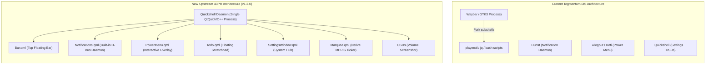

# 43PR/dotfiles Upstream Analysis & Feature Integration Guide

This guide provides a comprehensive technical breakdown of the latest updates in [43PR/dotfiles](https://github.com/43PR/dotfiles) (v1.2.0, commit `28d6864`), comparing them against your current **Tegmentum-OS** environment. 

Three dedicated research subagents conducted a source-level audit across the desktop shell, notification architecture, power management, theming engine, and Hyprland integration. This document serves as your permanent reference for evaluating, choosing, and porting any features into Tegmentum-OS.

---

## 1. Executive Summary: The Architectural Pivot

The upstream repository has undergone a major shift from a multi-daemon Unix desktop to a **unified, all-in-one Quickshell desktop environment**:



### Key Differences at a Glance

| Area | Current Tegmentum-OS | Upstream 43PR (v1.2.0) | Upstream Advantage |
| :--- | :--- | :--- | :--- |
| **Top Status Bar** | Waybar (GTK3) + custom shell scripts | Native Quickshell (`Bar.qml`) | Zero bash/jq polling forks, native PipeWire/UPower/Hyprland bindings, interactive calendar popup. |
| **Notifications** | Dunst standalone daemon | Quickshell `NotificationServer` (`Notifications.qml`) | Unified styling, slide-in toasts, interactive action buttons, persistent Notification Center drawer (<kbd>Super</kbd> + <kbd>N</kbd>). |
| **Power Menu** | Rofi powermenu (`powermenu.sh`) / wlogout | Native Quickshell `PowerMenu.qml` | Instant response (<5ms), live drag-repositioning & scaling (70%–150%), toggleable action buttons. |
| **Tasks / Notes** | None | Native Quickshell `Todo.qml` | Floating scratchpad checklist (<kbd>Super</kbd> + <kbd>C</kbd>) with in-place editing and disk persistence. |
| **Theming Engine** | Wallpaper-derived Matugen | Matugen + Curated Presets + `colorgen` toggle | 4 built-in presets (Catppuccin Mocha, Everforest Dark, Nord, Tokyo Night) and ability to pin themes against wallpaper changes. |
| **Settings Pages** | `SoundPage.qml`, `MonitorsPage.qml` | `AudioPage.qml`, `DisplayPage.qml`, modernized `ThemesPage.qml` | Standardized margin metrics, snap position persistence (`settings-state.json`), SVG-styled tab handle. |
| **File Manager** | Nautilus | Thunar (+ plugins) | Lighter resource footprint, faster startup, modular thumbnailers. |

---

## 2. Feature Deep-Dives

### Feature A: Native Quickshell Bar (`Bar.qml` & `Marquee.qml`)

`Bar.qml` replaces Waybar with a 24px-tall floating island bar on all connected monitors (`Variants { model: Quickshell.screens }`).

```
+-------------------------------------------------------------------------------------------------------------------+
| [ CPU 12% | RAM 45% | Workspaces (pill-dots) ]        [ 14:32 ] (Hover->Cal)        [ ♪ Track | 󰕾 60% | 󰤨 | 󰁹 85% | ⏻ ] |
+-------------------------------------------------------------------------------------------------------------------+
```

#### What It Delivers:
1. **Zero-Fork Resource Monitoring**:
   - Reads `/proc/stat` and `/proc/meminfo` directly via Quickshell's `FileView` on a 1-second timer.
   - Calculates CPU delta and RAM utilization in pure JavaScript without launching subshells (`free`, `top`, `awk`).
2. **Dynamic Workspaces**:
   - Listens directly to the Hyprland UNIX socket stream (`Quickshell.Hyprland.workspaces`).
   - Active workspace smoothly animates from a 10px circular dot to a 32px wide capsule. Urgent workspaces turn danger red.
   - Mouse wheel over workspaces switches workspaces (`hyprctl dispatch workspace e±1`).
3. **Interactive Calendar Popup**:
   - Hovering over the center clock opens an interactive calendar window with a 200ms close debounce.
   - Includes month navigation chevrons, month wheel paging, return-to-today shortcut, and highlight for the current day.
4. **Native MPRIS Marquee (`Marquee.qml`)**:
   - Tracks the active media player via `Quickshell.Services.Mpris`.
   - When titles exceed 180px, it pauses for 2.5 seconds, then performs a seamless 30fps single-pixel scroll across two mirrored text elements before wrapping smoothly. Zero CPU wake when paused.
5. **Direct PipeWire Volume**:
   - Bound directly to `Pipewire.defaultAudioSink`. Scrolling anywhere on the volume pill adjusts volume directly in-process (`sink.audio.volume += delta * 0.02`) without running `wpctl`.
6. **Smart Battery Module**:
   - Automatically hides itself on desktop systems (`isLaptopBattery` check via `Quickshell.Services.UPower`).
   - Displays 5-stage battery levels, charging bolt, and auto-tints red when <= 15% discharging.

> [!NOTE]
> **Tegmentum GPU Gap**: Upstream's `Bar.qml` does not have a GPU usage module. If adopting `Bar.qml`, we must port Tegmentum's `gpu_usage.sh` into a Quickshell `Process` component.

---

### Feature B: Notification Center Daemon (`Notifications.qml`)

Upstream deprecates Dunst by implementing a native Freedesktop notification daemon using `Quickshell.Services.Notifications.NotificationServer`.

#### Key Capabilities:
- **D-Bus Daemon Registration**: Directly acquires `org.freedesktop.Notifications`. Works with all standard apps (`notify-send`, Firefox, Spotify, Discord).
- **Toast Popups**:
  - Slide in from top-right beneath the bar with cubic easing (220ms).
  - Screen clicks pass through transparent areas via Wayland input masks (`mask: Region`).
  - Critical alerts are framed with a red border and never auto-expire.
  - Interactive notification action buttons trigger callbacks back to the sending application.
- **Notification Center Drawer**:
  - Toggled via `qs ipc call notifications toggle` (bound to <kbd>Super</kbd> + <kbd>N</kbd>).
  - Slides out as a full notification history panel.
  - Persists up to 100 historical notifications across reboots in `~/.cache/43pr/notifications.json`.
  - Supports individual item dismissal or one-click "Clear All".
- **Battery Sentinel**:
  - Automatically dispatches native desktop notifications when laptop battery hits <= 20% (Low) and <= 15% (Critical).

---

### Feature C: Interactive Power Menu (`PowerMenu.qml`)

Replaces `wlogout` and `powermenu.sh` with a fluid Quickshell overlay.

#### Key Capabilities:
- **Instantaneous Invocation**: Zero cold-start latency (<5ms) because it is kept resident in the Quickshell scene graph.
- **Actions Provided**: Shut down (`s`), Reboot (`r`), Suspend (`z`), Log out (`e`), Hibernate (`h`). *(Lock is easily added via `lock.png` and `hyprlock`).*
- **Built-in Interactive Customizer ('C' Key)**:
  - Pressing `'c'` opens live settings directly inside the menu.
  - **Live Drag-and-Drop**: Dragging the card repositions it anywhere on screen.
  - **Scale Slider**: Smoothly resizes the menu between 70% and 150% with live preview.
  - **Action Toggles**: Toggle individual power actions on or off.
  - **Persistence**: Automatically writes preferences to `~/.config/quickshell/state/powermenu-state.json`.
- **Display Targeting**: Inspects `Hyprland.focusedMonitor` to open on whichever screen currently has mouse focus.

---

### Feature D: Quick Task Checklist (`Todo.qml`)

A minimalist floating task manager and scratchpad designed for rapid keyboard-driven task jotting.

#### Key Capabilities:
- **Instant Access**: Bound to <kbd>Super</kbd> + <kbd>C</kbd> via `qs ipc call todo toggle`.
- **Keyboard Workflow**:
  - Input field automatically focuses on open.
  - Typing a task and pressing `Enter` inserts it at the top of the list.
  - `Shift` + `Enter` creates multi-line entries.
- **In-Place Editing**: Click directly on any existing task text to edit inline; changes save automatically.
- **Task Completion & Cleanup**: Checkboxes strike out completed items; a single footer button purges all checked tasks.
- **Persistence**: State is saved asynchronously with a 300ms debounce to `~/.config/quickshell/state/todo-state.json`.

---

### Feature E: Theming Engine Upgrades & Presets

Upstream introduces substantial enhancements to the 43PR theming pipeline (`theme.py`):

1. **Curated Preset Palettes**:
   - `catppuccin-mocha.toml`
   - `everforest-dark.toml`
   - `nord.toml`
   - `tokyo-night.toml`
2. **Color Generation Locking (`colorgen on|off`)**:
   - Solves the common frustration where setting a new wallpaper unintentionally destroys an active curated theme.
   - When `colorgen` is disabled, changing wallpapers updates the background image without running Matugen or rewriting application color schemes.
3. **Modernized `ThemesPage.qml`**:
   - Includes one-click buttons to activate any theme preset.
   - Includes an interactive switch for "COLOR GENERATION".
4. **Synchronized Opacity (`opacity.sh`)**:
   - Modifies Hyprland window rules, Quickshell `Theme.bgAlpha`, and Rofi background alpha in one coordinated execution.

---

### Feature F: Hot Corners (`SettingsCornerTrigger.qml`)

Creates invisible 10px hover trigger zones across the top border of the monitor:
- Left corner (`0–1%`): triggers `hyprlock`.
- Top-left (`25–40%`): toggles Settings.
- Right corner (`99–100%`): toggles PowerMenu.

> [!WARNING]
> **Tegmentum Ergonomics Warning**: You previously requested that top-edge hover triggers be disabled because brushing against the screen edge while browsing or moving windows accidentally triggered lockscreen and menus. This component should be **omitted** or left disabled in Tegmentum-OS.

---

## 3. Modular Cherry-Picking Menu

You can adopt any of these upstream features independently into Tegmentum-OS without breaking your custom workflow (arrow keys, per-workspace layouts, tiled fullscreen, `eza` aliases, true `clear`).

Here is the recommended menu of adoption modules:

### 🟢 Tier 1: Immediate Enhancements (Zero Risk, High Polish)
These add pure functionality without displacing existing window management or core daemons:

| Module | Files Needed | Description |
| :--- | :--- | :--- |
| **Theme Presets & Colorgen Toggle** | `.config/43pr/themes/*.toml`, `.config/43pr/bin/theme.py`, `ThemesPage.qml` | Adds Catppuccin, Nord, Tokyo Night, Everforest presets and the ability to lock colors during wallpaper changes. |
| **Todo Scratchpad App** | `quickshell/Todo.qml`, `keybinds.lua` (<kbd>Super</kbd> + <kbd>C</kbd>) | Adds the floating checklist with zero impact on other tools. |
| **Settings Pages Refactoring** | `SettingsPages/AudioPage.qml`, `DisplayPage.qml`, `SettingsWindow.qml` | Clean unified margins, snap state persistence, and curved tab handle. |

### 🟡 Tier 2: Shell Component Upgrades (Moderate Risk, High Payoff)
These replace specific desktop tools with native Quickshell equivalents:

| Module | Replaces | Files Needed | Notes |
| :--- | :--- | :--- | :--- |
| **Quickshell Power Menu** | `wlogout` / `powermenu.sh` | `quickshell/PowerMenu.qml`, `quickshell/imgs/` | Binds to <kbd>Super</kbd> + <kbd>Escape</kbd>. Instantaneous, draggable, resizable. Add Lock action. |
| **Quickshell Notifications** | `dunst` | `quickshell/Notifications.qml`, `keybinds.lua` (<kbd>Super</kbd> + <kbd>N</kbd>) | Requires stopping Dunst autostart. Adds slide-out notification drawer. |

### 🔴 Tier 3: Complete Shell Migration (Major Architectural Shift)
Replaces Waybar with the native Quickshell top bar:

| Module | Replaces | Files Needed | Notes |
| :--- | :--- | :--- | :--- |
| **Quickshell Top Bar** | `waybar` | `quickshell/Bar.qml`, `quickshell/Marquee.qml` | Native PipeWire volume, reactive workspaces, MPRIS marquee, interactive calendar. **Requires porting Tegmentum's GPU usage module.** |

---

## 4. Preservation Matrix: What Tegmentum-OS Must Keep

When importing files from upstream, the following Tegmentum-OS custom features must be strictly preserved:

1. **Window Management & Ergonomics**:
   - Arrow-key window navigation & layout moving (<kbd>Super</kbd> + Arrow keys).
   - Window sizing (<kbd>Super</kbd> + `+/-`, <kbd>Super</kbd> + <kbd>Alt</kbd> + `+/-`).
   - Window split toggle (<kbd>Super</kbd> + <kbd>J</kbd>).
   - Tiled fullscreen / maximize mode 1 (<kbd>Super</kbd> + <kbd>Ctrl</kbd> + <kbd>F</kbd>).
   - Persistent per-workspace layout toggle (<kbd>Super</kbd> + <kbd>L</kbd> via `toggle-workspace-layout.py`).
   - Fullscreen persistence across <kbd>Alt</kbd> + <kbd>Tab</kbd> cycling.
2. **Terminal & Shell Enhancements**:
   - Modern `eza` directory listing with icons and grouped directories.
   - True `clear` command with scrollback buffer purging (`\033[2J\033[3J\033[H`).
3. **Custom Quickshell Windows**:
   - `BrightnessOsd.qml` (laptop backlight OSD).
   - `KeybindsWindow.qml` (<kbd>Super</kbd> + <kbd>K</kbd> cheatsheet).
4. **Hardware Specifics**:
   - Laptop lid instant screen-off fix (`lid-handler.sh`).
   - GPU usage monitor (`gpu_usage.sh`).
