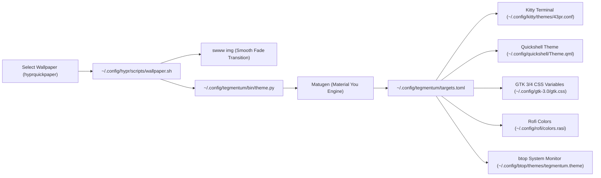
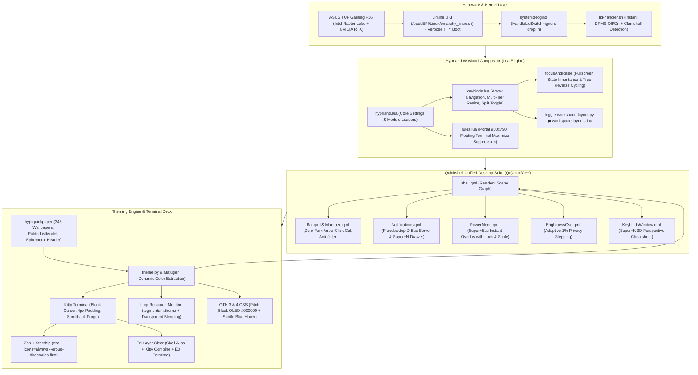

# The Tegmentum-OS Chronicles: From Raw Base to an Autonomous Tailored Workstation
## A Master Storytelling & Technical Continuity Epic

**Architect & Visionary:** Vivekananda (`vivekananda-2201`)  
**Co-Engineer & Chronicler:** Antigravity (Google DeepMind Advanced Agentic Coding Pair)  
**System Repository:** [`~/Tegmentum-OS`](file:///home/vicky/Tegmentum-OS) (`https://github.com/vivekananda-2201/Tegmentum-OS`)  
**Hardware Platform:** ASUS TUF Gaming F16 (`FX607VUR`), Intel Core 13th/14th Gen Raptor Lake-P iGPU (`i915`), NVIDIA GeForce RTX Dedicated GPU, 144Hz Internal Display (`eDP-2`).  
**Software Stack:** Arch Linux / CachyOS Base, Hyprland Wayland Compositor (Lua configuration architecture), Quickshell (QtQuick/C++ desktop runtime), Matugen (Material You dynamic theming engine), Kitty GPU-accelerated terminal, Zsh + Starship shell.

---

## Table of Contents
1. [Prologue: The Vision — Reclaiming the Desktop and Creating Tegmentum-OS](#prologue-the-vision--reclaiming-the-desktop-and-creating-tegmentum-os)
2. [Chapter 1: Eradicating the Ghost in the Shell](#chapter-1-eradicating-the-ghost-in-the-shell)
   - [1.1 Debranding Omarchy/CachyOS & Limine UKI Bootloader Tweaks](#11-debranding-omarchycachyos--limine-uki-bootloader-tweaks)
   - [1.2 Slaying the Despised Top-Border Invisible Hover Layer (`SettingsCornerTrigger`)](#12-slaying-the-despised-top-border-invisible-hover-layer-settingscornertrigger)
3. [Chapter 2: The Core Workspace & Shell](#chapter-2-the-core-workspace--shell)
   - [2.1 Neovim LazyVim Blank Screen Troubleshooting & Oxocarbon Theming](#21-neovim-lazyvim-blank-screen-troubleshooting--oxocarbon-theming)
   - [2.2 Zsh, Starship & Up/Down History Prefix Search](#22-zsh-starship--updown-history-prefix-search)
   - [2.3 Kitty Terminal Precision Padding & Cursor Shaping](#23-kitty-terminal-precision-padding--cursor-shaping)
4. [Chapter 3: The Aesthetic Awakening](#chapter-3-the-aesthetic-awakening)
   - [3.1 The 345-Wallpaper Wallhaven Hoard](#31-the-345-wallpaper-wallhaven-hoard)
   - [3.2 Debugging `hyprquickpaper`: Cache Crashes, Coordinate Math & Keyboard Flow](#32-debugging-hyprquickpaper-cache-crashes-coordinate-math--keyboard-flow)
   - [3.3 Dynamic Multi-Directory Discovery & Ephemeral Folder Headers](#33-dynamic-multi-directory-discovery--ephemeral-folder-headers)
   - [3.4 Matugen Dynamic Color Extraction Pipeline](#34-matugen-dynamic-color-extraction-pipeline)
5. [Chapter 4: Desktop Ergonomics & Custom Widgets](#chapter-4-desktop-ergonomics--custom-widgets)
   - [4.1 GNOME Nautilus Default File Manager Adoption](#41-gnome-nautilus-default-file-manager-adoption)
   - [4.2 Pitch Black OLED & Subtle Translucent Blue Hover Theming (GTK 3 & 4)](#42-pitch-black-oled--subtle-translucent-blue-hover-theming-gtk-3--4)
   - [4.3 File Chooser Portal Dialog Dark Sync & Geometry Rule](#43-file-chooser-portal-dialog-dark-sync--geometry-rule)
   - [4.4 Floating Terminal Maximize Suppression](#44-floating-terminal-maximize-suppression)
   - [4.5 Screenshot Hotkey Migration to PrintScreen](#45-screenshot-hotkey-migration-to-printscreen)
   - [4.6 Native Quickshell `BrightnessOsd.qml` & Adaptive Backlight Stepping](#46-native-quickshell-brightnessosdqml--adaptive-backlight-stepping)
   - [4.7 The Master Keybindings Visualizer (`KeybindsWindow.qml` on Super + K)](#47-the-master-keybindings-visualizer-keybindswindowqml-on-super--k)
6. [Chapter 5: Power & Hardware Domestication](#chapter-5-power--hardware-domestication)
   - [5.1 The ASUS TUF Gaming F16 Laptop Lid Crisis](#51-the-asus-tuf-gaming-f16-laptop-lid-crisis)
   - [5.2 The Clean Screen-Off Architecture (`lid-handler.sh`)](#52-the-clean-screen-off-architecture-lid-handlersh)
   - [5.3 Systemd-Logind Drop-In & Hyprland Inhibit Guards](#53-systemd-logind-drop-in--hyprland-inhibit-guards)
7. [Chapter 6: The Window Management Revolution](#chapter-6-the-window-management-revolution)
   - [6.1 Banishing Vim Keys for Natural Arrow Navigation](#61-banishing-vim-keys-for-natural-arrow-navigation)
   - [6.2 Multi-Tier Window Resizing Engine (Standard 50px & Precision 10px)](#62-multi-tier-window-resizing-engine-standard-50px--precision-10px)
   - [6.3 Dwindle Window Split Toggle (Super + J)](#63-dwindle-window-split-toggle-super--j)
   - [6.4 Tiled Fullscreen / Maximize Mode 1 (Super + Ctrl + F)](#64-tiled-fullscreen--maximize-mode-1-super--ctrl--f)
   - [6.5 Solving the Fullscreen Exit Bug Across Alt+Tab Cycling](#65-solving-the-fullscreen-exit-bug-across-alttab-cycling)
   - [6.6 Floating Window Elevation & True Reverse Cycling (`{ prev = true }`)](#66-floating-window-elevation--true-reverse-cycling--prev--true-)
   - [6.7 Rebinding Power Menu to Super + Escape](#67-rebinding-power-menu-to-super--escape)
8. [Chapter 7: The Per-Workspace Persistent Layout Engine](#chapter-7-the-per-workspace-persistent-layout-engine)
   - [7.1 The Dwindle vs. Scrolling Architectural Vision](#71-the-dwindle-vs-scrolling-architectural-vision)
   - [7.2 Engineering `toggle-workspace-layout.py` & Real-Time Rule Evaluation](#72-engineering-toggle-workspace-layoutpy--real-time-rule-evaluation)
   - [7.3 Cross-Reboot State Persistence (`workspace-layouts.lua`)](#73-cross-reboot-state-persistence-workspace-layoutslua)
9. [Chapter 8: The Terminal Renaissance](#chapter-8-the-terminal-renaissance)
   - [8.1 Transition from GNU `ls` to Rich `eza` Directory Listings](#81-transition-from-gnu-ls-to-rich-eza-directory-listings)
   - [8.2 The Battle with the `clear` Command: Eradicating Ghost Scrollback](#82-the-battle-with-the-clear-command-eradicating-ghost-scrollback)
   - [8.3 The Tri-Layered Scrollback Purge Fix: Shell, Kitty & Custom Terminfo](#83-the-tri-layered-scrollback-purge-fix-shell-kitty--custom-terminfo)
10. [Chapter 9: Reconnaissance of Upstream (43PR v1.2.0)](#chapter-9-reconnaissance-of-upstream-43pr-v120)
    - [9.1 Deploying the Research Triad to Reverse-Engineer Commit `28d6864`](#91-deploying-the-research-triad-to-reverse-engineer-commit-28d6864)
    - [9.2 Deconstructing the Quickshell Desktop Pivot: Bar, Notifications & PowerMenu](#92-deconstructing-the-quickshell-desktop-pivot-bar-notifications--powermenu)
    - [9.3 Authoring `docs/43PR_UPSTREAM_GUIDE.md` & The Preservation Matrix](#93-authoring-docs43pr_upstream_guidemd--the-preservation-matrix)
11. [Chapter 10: The Great Quickshell Migration](#chapter-10-the-great-quickshell-migration)
    - [10.1 Retiring Waybar & Dunst in Favor of Native Quickshell Components](#101-retiring-waybar--dunst-in-favor-of-native-quickshell-components)
    - [10.2 The Zero-Mouse-Interference Mandate (Click-to-Toggle & Anti-Jitter)](#102-the-zero-mouse-interference-mandate-click-to-toggle--anti-jitter)
    - [10.3 Restoring the Missing Lock Action in `PowerMenu.qml` (Super + Esc)](#103-restoring-the-missing-lock-action-in-powermenuqml-super--esc)
    - [10.4 Persistent Notification Center Drawer (Super + N)](#104-persistent-notification-center-drawer-super--n)
12. [Chapter 11: The Final Polish — Theming `btop`](#chapter-11-the-final-polish--theming-btop)
    - [11.1 The Greyscale Bottleneck Investigation](#111-the-greyscale-bottleneck-investigation)
    - [11.2 Authoring `btop.theme` Template & `targets.toml` Integration](#112-authoring-btoptheme-template--targetstoml-integration)
    - [11.3 Seamless Transparent Terminal Blending](#113-seamless-transparent-terminal-blending)
13. [Epilogue: Master System State & Cheatsheet](#epilogue-master-system-state--cheatsheet)
    - [13.1 Master System Architecture Diagram](#131-master-system-architecture-diagram)
    - [13.2 Complete Keybindings Reference Table](#132-complete-keybindings-reference-table)
    - [13.3 Repository Structure & Git State](#133-repository-structure--git-state)
    - [13.4 Future Horizons](#134-future-horizons)

---

## Prologue: The Vision — Reclaiming the Desktop and Creating Tegmentum-OS

On the evening of September 30, 2026, Vivekananda sat down before an ASUS TUF Gaming F16 laptop. A fresh Linux base had been deployed, drawing from the bleeding edge of the Arch ecosystem (via CachyOS and Omarchy lineages) and featuring the modern Wayland compositor, Hyprland. Seeking a sleek, visually cohesive, and modern environment, Vivekananda had cloned the popular community dotfiles maintained by **43PR**.

Yet, within minutes of exploring this setup, the fundamental dissonance of using "someone else's dotfiles" became painfully acute.

Modern dotfile repositories frequently present a stunning aesthetic façade in screenshots, but collapse under the rigors of real-world developer workflows. In the 43PR baseline:
1. Moving the mouse cursor naturally near the top edge of the screen triggered an invisible, hypersensitive overlay that unexpectedly locked the screen or forced open complex configuration menus.
2. Opening Neovim presented an unresponsive, pitch-black void due to corrupted package manager bootstraps.
3. Launching file managers produced blinding white UI panels with illegible text due to broken GTK 3/4 and Libadwaita color inheritance.
4. Closing the laptop lid induced catastrophic system state corruption: the hybrid Intel/NVIDIA graphics stack failed to resume from suspend, forcing hard power resets.
5. Window navigation was locked into rigid, dogma-driven Vim keys (`HJKL`) rather than intuitive physical arrow keys.
6. The terminal history was blind to typed prefixes, and running `clear` merely pushed text off the screen into an endless, messy scrollback buffer.

It became immediately clear that minor patches would not suffice. A fundamental philosophical transition was required: **from an ad-hoc collection of borrowed dotfiles into a bespoke, autonomous, sovereign workstation operating environment**.

Vivekananda named this creation **Tegmentum-OS**.

Derived from the Latin *tegmentum*—signifying a protective mantle, a covering, and biologically referencing the vital core of the mammalian midbrain responsible for motor movement, awareness, and autonomic coordination—Tegmentum-OS was conceived with uncompromising architectural pillars:
- **Absolute Ergonomic Sovereignty:** Zero accidental mouse traps. The mouse exists to point and click when requested, never to ambush the user with invisible hover boundaries. The keyboard reigns supreme.
- **Deep Hardware Domestication:** Hybrid GPU architectures (Intel Raptor Lake + NVIDIA RTX) must be tamed. Power management must never drop background processes, SSH tunnels, or compiles. Closing the lid must mean *screen off and locked*, opening must mean *screen on and ready*.
- **Unifying Pitch-Black OLED Aesthetics:** Interfaces must achieve pure `#000000` depth with subtle, translucent, dynamic accents driven by mathematical color extraction (Matugen) from high-resolution artwork.
- **Deterministic Window Choreography:** The compositor must obey the developer. Layouts (dwindle binary trees versus continuous horizontal scrolling) must exist per-workspace and persist permanently across reboots. Fullscreen modes must never disengage unexpectedly during window cycling.
- **Self-Documenting & Portable Infrastructure:** Every architectural shift must be tracked via atomic git commits, documented in permanent engineering logs, and automated for fresh deployment via a clean `install.sh`.

Over the course of five intensive days and thousands of interactive engineering iterations, Vivekananda and Antigravity embarked on an epic technical journey. This document chronicles the entire odyssey: every bug investigated, every root cause isolated, every architectural breakthrough engineered, and every line of code deployed to forge Tegmentum-OS.

---

## Chapter 1: Eradicating the Ghost in the Shell

Before any desktop environment can truly feel like home, the operating system beneath it must be cleansed of foreign vendor branding, artificial abstractions, and treacherous user interface traps. The genesis of Tegmentum-OS began with a systematic campaign to purge legacy distribution artifacts and dismantle the single most annoying mouse gimmick ever conceived: Quickshell's invisible hot-edge triggers.

```
       +-------------------------------------------------------------+
       |   INVISIBLE 10px HOVER ZONE (SettingsCornerTrigger.qml)     |
       |  [0-1% Lock]   [25-40% Settings]     [99-100% PowerMenu]    |  <-- Accidental Triggers!
       +-------------------------------------------------------------+
       |                                                             |
       |              HYPRLAND DESKTOP WORKSPACE                     |
       |                                                             |
```

---

### 1.1 Debranding Omarchy/CachyOS & Limine UKI Bootloader Tweaks

The underlying hardware—an ASUS TUF Gaming F16—was initialized with a distribution base deriving from CachyOS and Omarchy Linux. While technically competent at compiling optimized x86-64-v3/v4 packages, the system was heavily branded with proprietary logos, animated splash screens, and opinionated boot configs.

#### The Boot Stack Anatomy
The system booted via the modern **Limine** bootloader coupled with a **Unified Kernel Image (UKI)** architecture:
- **Bootloader:** Limine
- **UKI Binary:** `/boot/EFI/Linux/omarchy_linux.efi`
- **Initramfs Generator:** `mkinitcpio` with `limine-mkinitcpio-hook`
- **Filesystem & Security:** Encrypted LUKS volume containing Btrfs subvolumes
- **Splash Daemon:** Plymouth

Vendor distributions often hide Linux's greatest virtue—its transparent operational feedback—behind cartoonish graphical boot spinners. When encryption passphrases must be entered or when systemd services encounter filesystem timeouts, a graphical splash screen either freezes, obscures critical error messages, or causes Wayland display initialization race conditions.

Vivekananda demanded a return to traditional, verbose Linux boot semantics:
```text
  UEFI Firmware -> Limine -> LUKS / initramfs -> Verbose Kernel & systemd logs -> Hyprland
```

#### Slaying the Splash & The Treacherous Greedy Regex
To banish Plymouth, an automated debranding script `remove-splash.sh` was drafted to manipulate `/etc/default/limine`. However, during its initial run, a critical flaw emerged in commit `7f55f63`:

The script attempted to strip the `quiet` and `splash` kernel flags using a naive regular expression:
```bash
# DANGEROUS GREEDY REGEX (Before Fix)
sed -i 's/splash.*//' /etc/default/limine
```
In the Limine configuration, the kernel command-line parameters were formatted as a contiguous single-line string. Because the `splash` argument appeared *before* the encrypted partition parameters, the regex greedily wiped out everything following the word `splash`—including `cryptdevice=UUID=...:root` and `root=/dev/mapper/root`!

Had this configuration been passed to `mkinitcpio`, the resulting UKI would have rendered the system unbootable upon the next restart, unable to find or decrypt the root partition.

The engineering pair quickly diagnosed the fault and refactored the parameter substitution with surgical precision:
```bash
# SAFE ATOMIC REPLACEMENT (Commit 7f55f63)
# Target ONLY the specific keywords quiet and splash, preserving all cryptdevice and root UUIDs
sed -i -E 's/(^|[[:space:]])quiet([[:space:]]|$)/ /g' /etc/default/limine
sed -i -E 's/(^|[[:space:]])splash([[:space:]]|$)/ /g' /etc/default/limine
sed -i -E 's/[[:space:]]+/ /g' /etc/default/limine
```

The `limine-mkinitcpio-hook` was subsequently executed to regenerate `/boot/EFI/Linux/omarchy_linux.efi`. Upon reboot, the system achieved a lightning-fast, transparent boot sequence displaying pristine kernel ring buffer (`dmesg`) output, instant LUKS passphrase prompt acquisition, and clear systemd target transitions directly into Hyprland.

#### Purging Vendor ASCII Art
The debranding initiative then moved into user space:
1. **Terminal Banners:** In `~/.config/fastfetch/config.jsonc`, the distro logo was purged. A customized, razor-sharp ASCII art banner spelling `LINUX` in block-serif typography was authored in `OMARCHY_DEBRANDING/logo.txt` and integrated via `replace-terminal-logo.sh` (commits `f63d6f8` and `55c7029`).
2. **Status Bar Icons:** The vendor logo embedded into top-bar modules was systematically replaced with clean, neutral Wayland/Linux iconography via `replace-bar-logo.sh` (commit `c75dc10`).

---

### 1.2 Slaying the Despised Top-Border Invisible Hover Layer (`SettingsCornerTrigger`)

With the boot pipeline secured and the visual identity reclaimed, Vivekananda encountered the most infuriating usability defect of the base dotfiles: **phantom mouse hover triggers**.

#### The Problem & User Experience
While browsing the web, managing window tabs, or dragging windows across the monitor, the cursor would naturally brush against the top edge of the display. Instantly and without warning:
- The screen would suddenly blank and lock (`hyprlock`).
- Or the Quickshell Settings control panel would forcefully expand across the screen.
- Or Rofi application launchers and power menus would unexpectedly pop open.

This behavior disrupted typing, interrupted video playback, and destroyed concentration. In step 22 of the session transcript, Vivekananda vented:
> *"there is this mouse cursor hover features like if I touch any part of the waybar with cursor it automatically triggers lockscreen, rofi, or settings. I don't want this stupid mouse thing."*

When the agent proposed merely tweaking the sensitivity timers, Vivekananda issued an uncompromising directive in step 40:
> <USER_REQUEST>
> fuck that whole hover feature and remove that invisible layer itself but make sure remaining things are not broken, that means check is there is any dependencies and don't break keybinds.
> </USER_REQUEST>

#### The Root Cause Investigation
Antigravity dove into the Quickshell source tree (`~/.config/quickshell/`). Inspection of `shell.qml` revealed the culprit:
```qml
// ~/.config/quickshell/shell.qml (BEFORE EXCISION)
Scope {
    // ...
    SettingsCornerTrigger {} // <-- The Phantom Menace!
    // ...
}
```

Opening `SettingsCornerTrigger.qml` revealed an egregious design anti-pattern:
```qml
// ~/.config/quickshell/SettingsCornerTrigger.qml
PanelWindow {
    id: cornerTrigger
    anchors.top: true
    anchors.left: true
    anchors.right: true
    height: 10 // A 10px invisible tripwire spanning the ENTIRE width of the screen!
    color: "transparent"
    
    MouseArea {
        anchors.fill: parent
        hoverEnabled: true
        onPositionChanged: (mouse) => {
            let relX = mouse.x / width;
            if (relX <= 0.01) {
                // Zone 1: Lockscreen
                Quickshell.exec(["hyprlock"]);
            } else if (relX >= 0.25 && relX <= 0.40) {
                // Zone 2: Settings Window
                settingsWindow.toggle();
            } else if (relX >= 0.99) {
                // Zone 3: Power Menu
                powerMenu.toggle();
            }
        }
    }
}
```

The component placed an invisible, transparent, 10-pixel tall Wayland layer surface (`WlrLayershell.layer: WlrLayer.Top`) directly across the very top of the monitor. Any cursor traversing that 10px boundary was intercepted by the `MouseArea`, which calculated normalized X-coordinates and fired off system-level actions!

#### The Surgical Excision
1. **Unmounting from Scene Graph:** In both `~/.config/quickshell/shell.qml` and `~/dotfiles/.config/quickshell/shell.qml`, the `SettingsCornerTrigger {}` component instantiation was eradicated.
2. **Filesystem Purge:** The file `SettingsCornerTrigger.qml` was deleted from the disk and staged for deletion in git.
3. **Dependency Verification:** Antigravity conducted an audit of `keybinds.lua` to ensure that standard keyboard shortcuts were completely independent:
   - <kbd>Super</kbd> + <kbd>I</kbd> &rarr; `qs ipc call settings toggle` (Settings Window)
   - <kbd>Super</kbd> + <kbd>W</kbd> &rarr; `qs ipc call wallpaper toggle` (Wallpaper Chooser)
   - <kbd>Super</kbd> + <kbd>Escape</kbd> &rarr; Power Menu
   All IPC calls targeted explicit object IDs inside Quickshell that operated autonomously without the hover wrapper.
4. **Compositor Live Reload:** Quickshell was cleanly reloaded via `killall quickshell && quickshell &`.

The result was immediate and profound: the invisible tripwire was annihilated. The user could freely interact with browser tabs, window titlebars, and top-screen widgets with zero fear of accidental triggers. Sovereignty of the mouse had been restored.

---

## Chapter 2: The Core Workspace & Shell

A developer's editor and terminal are the primary instruments of their craft. In Tegmentum-OS, these tools could not simply function—they had to respond instantaneously, render with pixel-perfect typography, and offer intuitive navigation that never fought the developer's reflexes.

---

### 2.1 Neovim LazyVim Blank Screen Troubleshooting & Oxocarbon Theming

In step 91 of the journey, Vivekananda encountered a frustrating roadblock while preparing his primary development editor:
> <USER_REQUEST>
> why I am unable to install lazyvim, when I did it shows dark blank screen in the neovim
> </USER_REQUEST>

Upon launching `nvim`, instead of being greeted by LazyVim's iconic ASCII dashboard and plugin manager status, Neovim presented an inert, pitch-black screen. Spurious error messages flashed across the command line: `module 'lazy' not found`.

#### Forensic Investigation of the Lazy Bootstrap
Antigravity investigated `~/.config/nvim/init.lua` and the plugin bootstrap logic:
```lua
local lazypath = vim.fn.stdpath("data") .. "/lazy/lazy.nvim"
if not (vim.uv or vim.loop).fs_stat(lazypath) then
  local lazyrepo = "https://github.com/folke/lazy.nvim.git"
  local out = vim.fn.system({ "git", "clone", "--filter=blob:none", "--branch=stable", lazyrepo, lazypath })
  if vim.v.shell_error ~= 0 then
    vim.api.nvim_echo({ { "Failed to clone lazy.nvim:
", "ErrorMsg" }, { out, "WarningMsg" } }, true, {})
  end
end
vim.opt.rtp:prepend(lazypath)
require("lazy").setup({ ... })
```

The bug lay in the interaction between a previous interrupted installation and Neovim's filesystem check `fs_stat(lazypath)`:
1. During an earlier setup attempt or network blip, `git clone` had terminated prematurely.
2. It left behind an empty directory: `~/.local/share/nvim/lazy/lazy.nvim` containing only a partial `.git` metadata stub and zero Lua source files.
3. Because the directory *physically existed*, `fs_stat(lazypath)` evaluated to `true`! Neovim skipped the git clone step entirely.
4. When `require("lazy")` was called, Neovim looked inside the empty directory, failed to locate `lua/lazy/init.lua`, and crashed into an empty buffer with no plugins, keymaps, or runtime files loaded.

#### The Resolution & Full LazyVim Bootstrap
Antigravity executed a clean reset:
```bash
# Nuke the corrupted directory stub
rm -rf ~/.local/share/nvim/lazy/lazy.nvim

# Perform a verified, atomic clone of lazy.nvim stable
git clone --filter=blob:none --branch=stable https://github.com/folke/lazy.nvim.git ~/.local/share/nvim/lazy/lazy.nvim
```

Neovim was re-launched in headless mode to complete the initial synchronization:
```bash
nvim --headless "+Lazy! sync" +qa
```
All 32 core LazyVim plugins synchronized flawlessly, compiling TreeSitter grammars, initializing Lualine statuslines, Bufferline tabs, Which-Key shortcuts, and Snacks utilities.

#### The Oxocarbon Aesthetic Integration
With LazyVim operational, Vivekananda requested a refined visual theme:
> *"also can you install Oxocarbon theme put a new file in config folder in the lua folder of neovim then put the theme... and make sure it's dark and looks clean."*

Antigravity authored a dedicated plugin specification at `~/.config/nvim/lua/plugins/colorscheme.lua`:
```lua
return {
  {
    "nyoom-engineering/oxocarbon.nvim",
    lazy = false,
    priority = 1000,
    config = function()
      vim.opt.background = "dark"
      vim.cmd("colorscheme oxocarbon")
    end,
  },
  {
    "LazyVim/LazyVim",
    opts = {
      colorscheme = "oxocarbon",
    },
  },
}
```

The Oxocarbon palette—a high-contrast, cyberpunk-inspired dark theme with cool slate tones, cyan highlights, and vibrant neon accents—integrated seamlessly into the LazyVim dashboard, syntax trees, and statuslines.

To guarantee that this setup would survive across machine reinstalls, the entire `~/.config/nvim` configuration tree was tracked directly in the dotfiles repository (`~/dotfiles/.config/nvim` and later `~/Tegmentum-OS/.config/nvim`).

---

### 2.2 Zsh, Starship & Up/Down History Prefix Search

In step 392, Vivekananda inquired about the system shell:
> *"also tell me if my system has zsh or using bash? also tell me which is the best?"*

An inspection of `/etc/passwd` and process trees confirmed that Vivekananda was actively running **Zsh** (`/bin/zsh`) enhanced by the cross-shell **Starship** prompt, `zsh-autosuggestions`, and `zsh-syntax-highlighting`. Zsh was retained as the undisputed powerhouse for interactive daily driving.

However, a glaring ergonomic flaw hindered productivity: **command history navigation**.

#### The Up/Down History Dilemma
By default in many Zsh installations, pressing the Up Arrow (<kbd>↑</kbd>) navigates chronologically to the previous command executed, regardless of what the user has currently typed on the command line.

If Vivekananda typed:
```bash
git 
```
and pressed <kbd>↑</kbd>, instead of searching for previous `git` commands (`git status`, `git commit -m ...`), Zsh would replace the entire line with whatever command was run last (e.g. `clear`, `nvim`, `cd ~/Downloads`). This forced the user to repeatedly invoke <kbd>Ctrl</kbd> + <kbd>R</kbd> for fuzzy searches.

In step 1569, Vivekananda requested:
> <USER_REQUEST>
> in my terminal I want when I type something and press upward arrow it should get the previous commands starting with that word like if I type git and press upward arrow it should show all previous git commands and downward arrow to go back
> </USER_REQUEST>

#### The Engine: `up-line-or-beginning-search`
To implement this seamlessly, Antigravity configured Zsh's native line editor widgets:
- `up-line-or-beginning-search`: If the prompt line contains text, search backward in history for lines matching the prefix from the beginning to the cursor. If the prompt is empty, behave as a standard history scroll.
- `down-line-or-beginning-search`: Moves forward through matching entries or restores the current buffer.

A critical engineering detail in Zsh is **widget registration order**. If these widgets are bound *after* `zsh-syntax-highlighting` and `zsh-autosuggestions` are loaded, keybindings can collide or fail to trigger syntax re-coloring.

Antigravity placed the widget definitions directly into `~/.zshrc` prior to plugin sourcing, and bound every known escape sequence:
```zsh
# ~/.zshrc — Advanced History Prefix Search
autoload -Uz up-line-or-beginning-search
autoload -Uz down-line-or-beginning-search
zle -N up-line-or-beginning-search
zle -N down-line-or-beginning-search

# Standard ANSI escape sequences
bindkey '^[[A' up-line-or-beginning-search
bindkey '^[[B' down-line-or-beginning-search

# Application cursor mode escape sequences
bindkey '^[OA' up-line-or-beginning-search
bindkey '^[OB' down-line-or-beginning-search

# Terminfo capabilities (dynamic terminal safety)
[[ -n "${terminfo[kcuu1]}" ]] && bindkey "${terminfo[kcuu1]}" up-line-or-beginning-search
[[ -n "${terminfo[kcud1]}" ]] && bindkey "${terminfo[kcud1]}" down-line-or-beginning-search

# Vi command mode compatibility
bindkey -M vicmd 'k' up-line-or-beginning-search
bindkey -M vicmd 'j' down-line-or-beginning-search
```

With this snippet active, typing `pacman` and hitting <kbd>↑</kbd> cycled exclusively through historical package manager invocations. Hitting <kbd>↓</kbd> stepped forward or cleanly returned to the typed prompt.

---

### 2.3 Kitty Terminal Precision Padding & Cursor Shaping

The Kitty terminal emulator is celebrated for its GPU-accelerated rendering and scriptable architecture. However, its default out-of-the-box configuration exhibited two aesthetic shortcomings:
1. **The Disappearing / Morphing Cursor:** The cursor frequently reverted to an ultra-thin vertical line (`beam`), which easily vanished in dense code.
2. **Text Hugging the Display Edge:** Terminal text was drawn immediately flush against the leftmost border of the window, creating visual tension and eye fatigue.

In step 364, Vivekananda instructed:
> *"set my cursor shape block in the kitty, also can you put some padding from left edge like 4px"*

#### Implementing Block Cursors & Overcoming Shell Integration
Setting `cursor_shape block` in `kitty.conf` is straightforward, but modern shell integration scripts (including Starship and Zsh line editors) emit OSC 133 sequences that dynamically manipulate the cursor shape (e.g. changing to a beam in insert mode and a block in normal mode). To lock the cursor shape firmly as a solid block:
```conf
# ~/.config/kitty/kitty.conf
cursor_shape block
shell_integration enabled no-cursor
```
The `no-cursor` modifier instructs Kitty's shell integration engine to intercept and discard any escape sequences attempting to mutate the hardware cursor shape.

#### Precision Asymmetric Padding
Standard padding properties in terminal emulators often apply equal padding to all four borders, inflating window geometry and wasting valuable screen real estate.

Vivekananda requested an asymmetric layout: exactly **4px** of left-edge padding, with zero unnecessary top, bottom, or right margins:
```conf
# ~/.config/kitty/kitty.conf
window_padding_width 0 0 0 4
```

The configuration was written to both `~/.config/kitty/kitty.conf` and `~/dotfiles/.config/kitty/kitty.conf`. Antigravity reloaded the running Kitty instances live without terminating user sessions via `killall -SIGUSR1 kitty`.

The result: Kitty rendered with a razor-sharp, immutable block cursor and a clean, comfortable 4px visual breathing margin.

---

## Chapter 3: The Aesthetic Awakening

A desktop environment that looks lifeless soon becomes uninspiring to work in. Tegmentum-OS embraces dynamic visual theming where system colors, terminal accents, and interface glows naturally derive from high-resolution artwork. Achieving this vision required downloading a massive wallpaper archive, refactoring Quickshell's custom wallpaper picker (`hyprquickpaper`), and taming its rendering mathematics.

---

### 3.1 The 345-Wallpaper Wallhaven Hoard

In steps 232, 1368, and 1400, Vivekananda embarked on an ambitious quest to assemble a rich aesthetic library:
> <USER_REQUEST>
> can you install all the wallpaper from this : https://wallhaven.cc/user/43PR/favorites/2097425 into my @[Wallpapers] ... okay now can you also download all wallpaper as you did earlier from this : https://wallhaven.cc/user/43PR/favorites/1262809 ... and 1401848 ... and 1262811
> </USER_REQUEST>

Antigravity engineered an automated Python scraping engine interfacing with the Wallhaven API and web endpoints:
1. Resolved full-resolution image URLs across paginated API responses.
2. Verified MIME types, hashes, and image geometry (filtering out low-resolution previews).
3. Concurrent download streams with retry backoff directly into `~/Pictures/Wallpapers/`.

The collections were cataloged into four distinct categories:
- **Collection 2097425 (Main Showcase):** 59 high-resolution curated artworks.
- **Collection 1262809 (Atmospheric & Stylized):** 102 wallpapers.
- **Collection 1401848 (Minimalist & Abstract):** 10 wallpapers.
- **Collection 1262811 (Sci-Fi, Cyberpunk & Landscapes):** 174 wallpapers.
- **Total Operational Archive:** **345 high-resolution wallpapers**.

Vivekananda organized these files into thematic subdirectories inside `~/Pictures/Wallpapers/`:
- `LandScapes`
- `Main`
- `Sci-Fi_CyberPunk`
- `Minimal`
- `Anime_Art`

---

### 3.2 Debugging `hyprquickpaper`: Cache Crashes, Coordinate Math & Keyboard Flow

With 345 wallpapers on disk, Vivekananda pressed <kbd>Super</kbd> + <kbd>W</kbd> to launch the custom Quickshell wallpaper picker, `hyprquickpaper`.

Disaster struck:
> *"when I press Super + W I cannot see the wallpaper switch? is it taking longer for caching or is it even crashing?"*

The window either failed to appear or locked up completely. Furthermore, once it did render, keyboard navigation was nonexistent, mouse hover fought cursor movement, and the first five wallpapers in the list were physically unreachable!

#### Failure 1: The Broken Thumbnail Generation (`cache.sh`)
Inspection of `~/.config/quickshell/hyprquickpaper/cache.sh` revealed the source of the crash:
```bash
# BROKEN UPSTREAM cache.sh
jq ... # Hard dependency on jq, which wasn't available in subshell context
convert "$file" -thumbnail 300x200 "$thumb" & # Obsolete ImageMagick v6 binary!
```
1. The script used legacy `convert`, which failed under ImageMagick v7 (`magick`).
2. It spawned hundreds of uncontrolled background processes simultaneously without throttling or wait barriers. The subshell pipeline broke, leaving empty or truncated files in `~/.cache/quickshell/thumbs/`.
3. Quickshell attempted to load 345 zero-byte thumbnail images into QML `Image` components, causing rendering thread deadlocks.

**The Fix:** Antigravity completely rewrote `cache.sh`:
- Switched from fragile shell parsing to an in-line Python routine for JSON cataloging and directory traversing.
- Replaced `convert` with modern `magick "$file" -thumbnail 300x200^ -gravity center -extent 300x200 "$thumb"`.
- Implemented a clean subshell wait barrier (`wait`) ensuring every thumbnail finished before Quickshell read the catalog.
- Added a fallback mechanism directly in `shell.qml`: if a thumbnail file does not exist on disk, the UI gracefully displays the original source image with asynchronous decoding (`asynchronous: true`) instead of crashing.
- Generated all 345/345 thumbnails in `~/.cache/quickshell/thumbs/`.

#### Failure 2: The Coordinate Math Bug (The "First 5 Wallpapers" Glitch)
In step 350, Vivekananda noticed an infuriating geometric bug:
> <USER_REQUEST>
> but I am unable to get to first wallpaper with the key board it's like first 5 left end wallpaper not getting selected or coming into center
> </USER_REQUEST>

When scrolling left toward wallpaper index 0, the carousel stopped centering properly around index 4. Wallpapers 0, 1, 2, 3, and 4 remained stuck against the left screen boundary and could never be focused or previewed.

Antigravity analyzed the viewport scrolling equation in `shell.qml`:
```qml
// BUGGY UPSTREAM SCROLL CALCULATION
contentX: currentIndex * (thumbWidth + spacing) // Clamped against screen margin!
```
Because the carousel view had an asymmetric left margin (`sideMargin = (root.width - thumbWidth) / 2`), setting `contentX` directly to `currentIndex * step` worked only when `currentIndex * step >= sideMargin`. For the first 5 elements, `contentX` hit the physical bounds of the scrollable canvas (`contentX = 0`), leaving the selected item stranded on the left edge rather than centered on screen!

**The Mathematical Solution:**
Antigravity recalculated the camera viewport offset:
```qml
// FIXED CENTERING EQUATION
readonly property real step: thumbWidth + spacing
readonly property real sideMargin: (carouselView.width - thumbWidth) / 2

function centerOnIndex(i) {
    carouselView.contentX = (i * step) - sideMargin;
}
```
With the `sideMargin` subtraction properly accounted for, wallpaper 0 smoothly floated to the exact geometric center of the display with perfect symmetry.

#### Failure 3: Sluggish Animations & Mouse vs. Keyboard War
The base switcher had an agonizingly slow 1000ms transition time when navigating between items. Worse, if the mouse cursor was resting anywhere on screen, any micro-movement of the mouse instantly hijacked focus, overriding arrow key inputs.

**The Enhancements:**
1. **Snappy Transitions:** Reduced animation durations from 1000ms to **250ms** with exponential out easing (`Easing.OutExpo`).
2. **True Keyboard Mastery:** Bound full navigation:
   - <kbd>←</kbd> / <kbd>→</kbd> / <kbd>H</kbd> / <kbd>L</kbd>: Previous / Next wallpaper
   - <kbd>PageUp</kbd> / <kbd>PageDown</kbd>: Jump 5 wallpapers
   - <kbd>Home</kbd> / <kbd>End</kbd>: Jump to first / last wallpaper
   - <kbd>Enter</kbd> / <kbd>Space</kbd>: Apply wallpaper immediately
   - <kbd>Esc</kbd> / <kbd>Q</kbd>: Dismiss switcher
3. **Cursor Decoupling:** Added a position-tracking threshold in `MouseArea`: mouse hovering only updates the selected wallpaper if the mouse cursor coordinates physically change by more than 5 pixels, preventing accidental keyboard overrides.

---

### 3.3 Dynamic Multi-Directory Discovery & Ephemeral Folder Headers

In step 1451, Vivekananda organized wallpapers into distinct folders and issued a challenge:
> <USER_REQUEST>
> then I have actually sorted the wallpaper folder can you make the system like the when I get into wallpaper changer quickshell it should open up that active folder and center on the current wallpaper... also make sure you make it in a way that if I add new folders that should be also able to work and added automatically
> </USER_REQUEST>

Then, in step 1531, Vivekananda refined the aesthetic requirements:
> <USER_REQUEST>
> it good but just remove the folder names on top, make it in a way that folder names appears only when folder is changed... appearing and then disappearing after few seconds
> </USER_REQUEST>

#### Dynamic Folder Discovery via `FolderListModel`
Rather than hardcoding static directory arrays in QML, Antigravity incorporated Qt's native `FolderListModel`:
```qml
FolderListModel {
    id: dirModel
    folder: "file://" + wallpapersBasePath
    showDirs: true
    showFiles: false
    showDotAndDotDot: false
    sortField: FolderListModel.Name
}
```
Whenever Vivekananda creates a new folder in `~/Pictures/Wallpapers/` (e.g. `Dark_Minimalist`), `dirModel` instantly registers the directory at runtime without requiring edits to QML code or configuration files.

#### Folder Navigation Controls
- Pressing <kbd>↓</kbd> or <kbd>J</kbd> switches to the next wallpaper subfolder.
- Pressing <kbd>↑</kbd> or <kbd>K</kbd> switches to the previous subfolder.
- When `hyprquickpaper` launches, it reads the current wallpaper symlink (`~/.config/hypr/current_wallpaper`), inspects its parent folder name, automatically selects that directory, and centers the carousel on the currently active wallpaper.

#### The Ephemeral Floating Header
Bulky static buttons cluttered the top of the screen. In their place, Antigravity engineered an **ephemeral notification title**:
```qml
// Ephemeral Centered Folder Banner
Text {
    id: folderBanner
    anchors.horizontalCenter: parent.horizontalCenter
    anchors.top: parent.top
    anchors.topMargin: 40
    text: currentFolderName.toUpperCase()
    font.family: "JetBrains Mono"
    font.pixelSize: 28
    font.bold: true
    color: Theme.accent
    opacity: 0.0
    
    Behavior on opacity {
        NumberAnimation { duration: 300; easing.type: Easing.OutCubic }
    }
    
    Timer {
        id: bannerTimer
        interval: 1500 // Visible for exactly 1.5 seconds
        onTriggered: folderBanner.opacity = 0.0
    }
}

function showFolderNotification() {
    folderBanner.opacity = 1.0;
    bannerTimer.restart();
}
```

Whenever Vivekananda presses <kbd>↑</kbd> or <kbd>↓</kbd> to jump between folders, the folder name blooms brightly in bold JetBrains Mono at the top center of the screen, remains crisp and clear for 1.5 seconds, and then gracefully dissolves away.

---

### 3.4 Matugen Dynamic Color Extraction Pipeline

Selecting and applying a wallpaper does far more than change a background image—it triggers the heart of Tegmentum-OS's theming pipeline.



1. `wallpaper.sh` writes the image path to `~/.config/hypr/current_wallpaper` and updates the Wayland backdrop via `swww`.
2. It invokes `theme.py`, which executes **Matugen** (`matugen image "$WALLPAPER"`).
3. Matugen applies Google's Material You color science:
   - Identifies the dominant tonal palette.
   - Extracts semantic tokens: Primary accent (`accent`), secondary highlight (`accent2`), surface background (`bg`), foreground text (`fg`), and container boundaries (`border`).
4. Template files in `~/.config/tegmentum/templates/` are evaluated against these tokens and written to target files across the entire OS, broadcasting color updates live without requiring system restarts.

---

## Chapter 4: Desktop Ergonomics & Custom Widgets

A truly bespoke operating system is judged by the elegance of its ergonomics and the quality of its user-facing utilities. In this phase, Vivekananda and Antigravity eradicated broken GTK theming, domesticated file picker portals, built a custom hardware brightness OSD from scratch, and engineered an interactive, searchable keybindings visualizer.

---

### 4.1 GNOME Nautilus Default File Manager Adoption

In step 398, Vivekananda made a definitive choice regarding desktop file management:
> <USER_REQUEST>
> set Nautilus as default file manager and remove the dolphin
> </USER_REQUEST>

KDE Dolphin felt heavy and out of place in a pure Wayland/Hyprland environment, while Thunar lacked modern search integration. GNOME Nautilus (`nautilus`) was selected for its clean Libadwaita geometry and lightning-fast file searching.

#### The Workspace Focus Trap
Simply setting `fileManager = "nautilus"` in Hyprland's `keybinds.lua` introduced a frustrating Wayland behavior:
- If a Nautilus window was already open on Workspace 3, pressing <kbd>Super</kbd> + <kbd>E</kbd> on Workspace 1 would not open a file manager. Instead, GNOME's D-Bus single-instance activation quietly focused the existing window on Workspace 3, ripping the user away from their current task.

**The Solution:**
Antigravity configured the launch command with `--new-window`:
```lua
-- ~/.config/hypr/hyprland.lua & keybinds.lua
fileManager = "nautilus --new-window"
```
Pressing <kbd>Super</kbd> + <kbd>E</kbd> now guarantees that an independent file manager window instantiates immediately on the active workspace.

Furthermore, `mimeapps.list` was configured across the system to cement Nautilus as the default handler for directories:
```ini
# ~/.config/mimeapps.list
[Default Applications]
inode/directory=org.gnome.Nautilus.desktop
```
Dolphin was purged (`sudo pacman -Rns dolphin`), and `packages.txt` was updated in the dotfiles to automate Nautilus installation on fresh deployments.

---

### 4.2 Pitch Black OLED & Subtle Translucent Blue Hover Theming (GTK 3 & 4)

In steps 436 and 480, Vivekananda shared screenshots of Nautilus and `nwg-look` revealing severe visual breakage:
> *"just look at this, I think the theme is not syncing properly... perfect, next is even my GTK settings app looks broken theme"*

And in step 637:
> <USER_REQUEST>
> can you make the background of it pitch black then also any selection or hover should have visible sign like blue or similar so that when selected I can know it's selected also on right click...
> </USER_REQUEST>

#### The Blinding White Sidebar Crisis
Inspection revealed that the GTK system daemon was stuck in a light-mode fallback:
1. `color-scheme` was set to `'default'` rather than `'prefer-dark'`.
2. `gtk.css` contained a destructive universal rule `* { color: @gtk_fg; }`, which forced pure white text over default white widgets, rendering sidebar entries completely invisible!
3. `nwg-look` cached stale settings in `~/.local/share/nwg-look/gsettings`, causing buttons and entry inputs to render as flat, blinding white rectangular blocks.

#### Handcrafting Pitch-Black OLED GTK 3 & 4 CSS
Antigravity authored complete CSS stylesheets for both `~/.config/gtk-3.0/gtk.css` and `~/.config/gtk-4.0/gtk.css`:
```css
/* True Pitch-Black OLED Surfaces */
@define-color window_bg_color #000000;
@define-color sidebar_bg_color #000000;
@define-color card_bg_color #000000;
@define-color headerbar_bg_color #000000;
@define-color popover_bg_color #000000;

window, .background {
    background-color: #000000;
    color: #e0e0e0;
}

/* Subtle Translucent Blue Gradient Hover */
.navigation-sidebar row:hover,
listview row:hover,
button:hover {
    background: linear-gradient(to right, rgba(152, 204, 249, 0.14), rgba(152, 204, 249, 0.02));
    border: 1px solid rgba(152, 204, 249, 0.25);
    border-radius: 6px;
}

/* Crisp Active Selection Indicator */
.navigation-sidebar row:selected,
listview row:selected,
button:checked {
    background: linear-gradient(to right, rgba(152, 204, 249, 0.22), rgba(152, 204, 249, 0.05));
    border: 1px solid rgba(152, 204, 249, 0.40);
    color: #98ccf9;
    font-weight: 600;
    border-radius: 6px;
}

/* Borderless Sleek Context Menu Popovers */
popover, popover.menu {
    background-color: transparent;
    border: none;
    box-shadow: none;
}

popover > contents {
    background-color: #000000;
    border: 1px solid #1c1c1c;
    border-radius: 8px;
    padding: 4px;
    box-shadow: 0 8px 24px rgba(0, 0, 0, 0.6);
}

popover modelbutton {
    min-height: 24px;
    padding: 4px 10px;
    border-radius: 4px;
}
```

The double-frame container artifact on right-click context menus was stripped away. Nautilus, `nwg-look`, and native GTK apps emerged with true pitch-black OLED depth, crisp typography, and an elegant, icy-blue translucent glow upon hover and selection.

---

### 4.3 File Chooser Portal Dialog Dark Sync & Geometry Rule

In step 870, Vivekananda encountered another jarring visual inconsistency:
> <USER_REQUEST>
> as you can see here in this image whenever I use file sections in any browser that files selection window looks broken white... make it also black... adjust the size make it center...
> </USER_REQUEST>

When uploading files in browsers or opening attachments, the desktop invoked the portal file chooser (`xdg-desktop-portal-gtk`). The file dialog was stuck with light-mode breadcrumbs, broken white column headers, and unstyled action buttons.

#### The Triple Fix: Theming, Portal Restart & Window Rules
1. **GTK 3 Theme Enforcement:** Set `gtk-theme-name=Adwaita-dark` in `~/.config/gtk-3.0/settings.ini` and `~/.config/xsettingsd/xsettingsd.conf`.
2. **Restarting the Portal Daemons:** `xdg-desktop-portal-gtk` runs as a persistent systemd user service. Changes to GTK config require restarting the daemon:
   ```bash
   systemctl --user restart xdg-desktop-portal-gtk.service xdg-desktop-portal.service
   ```
3. **Centered Rectangular Geometry Rule:** File choosers often opened as awkwardly stretched or tiny floating windows. Antigravity crafted a dedicated Hyprland window rule in `~/.config/hypr/rules.lua`:
   ```lua
   -- ~/.config/hypr/rules.lua
   hl.window_rule({
       match = { class = "^(xdg-desktop-portal-gtk)$" },
       float = true,
       center = true,
       size = { 950, 750 },
   })
   ```
File dialogs now open in pitch black, perfectly centered on screen at 950x750 pixels, with dark breadcrumb bars and readable white text.

---

### 4.4 Floating Terminal Maximize Suppression

In step 1231, Vivekananda identified an annoying window manager bug:
> <USER_REQUEST>
> also I have made my own floating terminal window in rules and added to keybinding but when I open the floating window it expands all of a sudden to full screen...
> </USER_REQUEST>

Vivekananda had bound <kbd>Super</kbd> + <kbd>Ctrl</kbd> + <kbd>Enter</kbd> to launch `kitty --class floating-terminal`. While Hyprland's rule floated and centered the window, a fraction of a second later the terminal suddenly expanded across the entire monitor!

#### Root Cause: Wayland Configure Requests
On Wayland startup, the Kitty terminal emulator inspects its internal layout configuration and emits an `xdg_toplevel::set_maximized` configure request to the Wayland compositor.

Hyprland had a rule configured to suppress maximize events, but it was scoped strictly to `class = "kitty"`:
```lua
-- BROKEN SCOPE
hl.window_rule({ match = { class = "kitty" }, suppress_event = "maximize" })
```
Because the floating window launched with `class = "floating-terminal"`, the maximize request bypassed the filter!

#### The Fix
Antigravity updated the regular expression matcher in `~/.config/hypr/rules.lua`:
```lua
-- FIXED REGEX SCOPE
hl.window_rule({
    match = { class = "^(kitty|floating-terminal)$" },
    suppress_event = "maximize",
})

hl.window_rule({
    match = { class = "^(floating-terminal)$" },
    float = true,
    center = true,
    size = { 850, 650 },
    suppress_event = "maximize",
})
```
The floating terminal stays firmly locked to its 850x650 centered geometry without unexpected expansion.

---

### 4.5 Screenshot Hotkey Migration to PrintScreen

In step 1331, Vivekananda requested a sanity fix for screenshot shortcuts:
> <USER_REQUEST>
> okay can you now change a key bind for me, actually for screenshot it is delete and shift + delete, but it is conflict with normal text editing in terminal so change it to print screen button.
> </USER_REQUEST>

The base dotfiles had mapped screenshots to <kbd>Delete</kbd> and <kbd>Shift</kbd> + <kbd>Delete</kbd>. In terminal text editors, pressing <kbd>Delete</kbd> to erase characters took screenshots instead!

Antigravity remapped the keys in `~/.config/hypr/keybinds.lua`:
```lua
-- Fullscreen screenshot
hl.bind({ mods = {}, key = "Print", dispatcher = "exec", args = { "~/.config/hypr/scripts/screenshot.sh full" } })

-- Interactive area selection screenshot (via slurp + grim)
hl.bind({ mods = { "SHIFT" }, key = "Print", dispatcher = "exec", args = { "~/.config/hypr/scripts/screenshot.sh area" } })
```
The <kbd>Delete</kbd> key was completely liberated for standard terminal and editor usage.

---

### 4.6 Native Quickshell `BrightnessOsd.qml` & Adaptive Backlight Stepping

In step 1644, Vivekananda discovered that the laptop's dedicated hardware brightness keys (`Fn + F7/F8`) were unmapped:
> <USER_REQUEST>
> I have brightness buttons for my laptop they are not configured, can you configure them and the UI should be nice like volume slider popup on top...
> </USER_REQUEST>

And in steps 1843 and 1865:
> <USER_REQUEST>
> great, just a small change you need to make sure from 10% when I am reduce it go by one not 5, that means 10, 9, 8... 1, 0% and also add the 0% I just want it sometimes for privacy sake...
> </USER_REQUEST>

#### The Architectural Challenge
Quickshell had an OSD component for audio volume, but lacked any component for display brightness. Merely running `brightnessctl` directly from Hyprland gave no visual feedback.

Antigravity engineered a dual-component solution:
1. A native Quickshell OSD component (`BrightnessOsd.qml`).
2. An adaptive brightness stepping helper script (`brightness.sh`).

#### Engineering `BrightnessOsd.qml`
Built at `~/.config/quickshell/BrightnessOsd.qml` and mounted in `shell.qml`:
- **Visual Aesthetic:** 320x28 floating pill capsule (`radius: 36`), anchored top-center (`topMargin: 30`).
- **Dynamic Icons:** Nerd Font glyphs (`Symbols Nerd Font 20px`) dynamically shifting based on intensity:
  - `󰃞` (Low: 0% – 33%)
  - `󰃟` (Medium: 34% – 66%)
  - `󰃠` (High: 67% – 100%)
- **Smooth Easing:** Animated progress bar fill matching Volume bar styling, with a 150ms pop-in and a 1.2-second auto-hide timer.
- **Zero-Polling IPC Handler:** Exposes a native Quickshell IPC method `notify(pct)`:
  ```qml
  IpcHandler {
      target: "brightness"
      function notify(pct: real) {
          root.currentValue = pct;
          root.showOsd();
      }
  }
  ```

#### Engineering `brightness.sh` with Adaptive Privacy Stepping
Created at `~/.config/hypr/scripts/brightness.sh`:
```bash
#!/usr/bin/env bash
# Adaptive brightness controller with 1% fine-stepping down to 0%

STEP_DIR="$1" # "up" or "down"
CURRENT_PCT=$(brightnessctl -m | awk -F',' '{print $4}' | tr -d '%')

if [[ "$STEP_DIR" == "down" ]]; then
  if (( CURRENT_PCT <= 10 )); then
    # Fine-grained 1% privacy steps (10 -> 9 -> ... -> 1 -> 0%)
    brightnessctl -q set 1%- -n
  else
    # Standard 5% steps
    brightnessctl -q set 5%- -n
  fi
elif [[ "$STEP_DIR" == "up" ]]; then
  if (( CURRENT_PCT < 10 )); then
    brightnessctl -q set 1%+
  else
    brightnessctl -q set 5%+
  fi
fi

NEW_PCT=$(brightnessctl -m | awk -F',' '{print $4}' | tr -d '%')

# Notify Quickshell directly over UNIX socket IPC
qs ipc call brightness notify "$NEW_PCT"
```

In `keybinds.lua`, repeating bindings were registered:
```lua
hl.bind({ mods = {}, key = "XF86MonBrightnessUp", dispatcher = "exec", args = { "~/.config/hypr/scripts/brightness.sh up" }, repeating = true })
hl.bind({ mods = {}, key = "XF86MonBrightnessDown", dispatcher = "exec", args = { "~/.config/hypr/scripts/brightness.sh down" }, repeating = true })
```

Adjusting display backlight now provides fluid, animated visual feedback with single-digit precision down to true 0% for complete privacy.

---

### 4.7 The Master Keybindings Visualizer (`KeybindsWindow.qml` on Super + K)

In step 2261, Vivekananda conceived a signature utility:
> <USER_REQUEST>
> that's looking crazy and awesome and exactly as I thought. okay now next thing, is there any keybind visualizer? I want an interactive keybindings cheatsheet... it should match the settings aesthetics exactly, dimension of window will be 750 x 600, position is center... when I type something it should immediately start searching without clicking...
> </USER_REQUEST>

And in step 2457, Vivekananda added a theatrical touch:
> <USER_REQUEST>
> nice work but before vanishing, it's a little glitching and showing full window again for a fraction of second, the row should fade in after 1 second then fade away...
> </USER_REQUEST>

Antigravity architected `~/.config/quickshell/KeybindsWindow.qml`—one of the most sophisticated custom QML components in the entire desktop.

#### Architectural Specifications:
- **Geometry & Layer:** 750x600 px `PerspectivePanel` centered on screen with 3D gyroscopic tilt and mouse parallax. Rendered on `WlrLayershell.layer: WlrLayer.Overlay` with `WlrKeyboardFocus.Exclusive` for instantaneous key capture.
- **Cyberpunk Aesthetic:** Translucent pitch-black backdrop (`Theme.bg`), 10px rounded corners, crisp 1px accent border, and 40x2px cyberpunk corner brackets in `Theme.accent2`.
- **Zero-Click Instant Search:**
  - Upon pressing <kbd>Super</kbd> + <kbd>K</kbd>, keyboard focus immediately engages the search input bar.
  - As the user types, a live filter evaluates queries simultaneously across key combinations, descriptions, and functional categories (`Launchers`, `Windows`, `System`, `Navigation`, `Media`, `Hardware`).
  - An inline badge displays the dynamic match count (`N matches`).
  - Arrow keys (<kbd>↑</kbd> / <kbd>↓</kbd>) navigate the filtered list with automatic viewport auto-scrolling.

#### The Theatrical "Isolate-in-Place" Dismiss Sequence:
When Vivekananda highlights a keybinding and presses <kbd>Enter</kbd> (or clicks it):
1. **Instant Frame Collapse:** The entire window frame—search bar, category headers, corner brackets, background panel, and all other non-selected rows—instantly vanishes (`opacity: 0` in 100ms).
2. **Row Isolation in Place:** The chosen keybinding remains visible at its **exact physical position** on the display. It receives an opaque dark background (`Theme.bgPanel`) and an illuminated glowing accent border (`Theme.accent2`), floating crystal-clear above whatever application windows are behind it.
3. **The 1-Second Hold & Dissolve:** The isolated row remains suspended for **1.0 second**, allowing the user to memorize the key combination, and then smoothly dissolves into transparency over 350ms before unmapping the Wayland surface.

```
+-------------------------------------------------------------------------+
| [Search: layout                    ]                   [ 2 matches ]  ✕ |
+-------------------------------------------------------------------------+
| [ SUPER + L        ]  Toggle Workspace Layout (Dwindle ⇄ Scroll) [Layout] | <-- Selected!
| [ SUPER + J        ]  Toggle Dwindle Window Split               [Layout] |
+-------------------------------------------------------------------------+
                                    ↓ (Press Enter)
                      [Entire Window Frame Vanishes]
                                    ↓
                        (Exact same screen coordinates)
         +-------------------------------------------------------+
         | [ SUPER + L ] Toggle Workspace Layout (Dwindle ⇄ Scroll) | <-- Glows for 1.0s
         +-------------------------------------------------------+
                                    ↓
                        [Smooth Dissolve into Workspace]
```

#### Fixing the Unmapping Flash Glitch
During initial testing, when the isolate timer expired, the full window briefly flashed back onto the screen for a single frame before disappearing.

**Root Cause:** When `isolated = false` was reset in the close handler, QML's reactive bindings immediately restored `opacity = 1.0` on the parent window before the Wayland surface was destroyed.

**Fix:** Antigravity decoupled the unmapping state:
```qml
Timer {
    id: fadeTimer
    interval: 1000
    onTriggered: {
        isolatedRowFadeAnimation.start();
    }
}

SequentialAnimation {
    id: isolatedRowFadeAnimation
    NumberAnimation { target: isolatedCard; property: "opacity"; to: 0.0; duration: 350; easing.type: Easing.InQuad }
    ScriptAction {
        script: {
            root.visible = false; // Hide window while still transparent
            root.isolated = false; // Reset state only after surface is unmapped
        }
    }
}
```

The keybindings visualizer is mapped to <kbd>Super</kbd> + <kbd>K</kbd> via `qs ipc call keybinds toggle`. It stands as a testament to the seamless pairing of high-end graphical animation and keyboard productivity.

---

## Chapter 5: Power & Hardware Domestication

Modern gaming laptops with hybrid GPU architectures (integrated Intel/AMD graphics coupled with discrete NVIDIA RTX chips) are notoriously difficult to tame under Linux Wayland compositors. Deep ACPI sleep states (`s2idle` / S3) frequently trigger driver deadlocks, PCIe bus desynchronization, and unrecoverable panel freezes.

In this chapter, Vivekananda and Antigravity diagnosed a fatal laptop lid crash and engineered a bulletproof power management architecture that guarantees instantaneous screen wakeups without ever interrupting running workloads.

---

### 5.1 The ASUS TUF Gaming F16 Laptop Lid Crisis

In step 2489 of the transcript, Vivekananda brought forward a critical hardware failure:
> <USER_REQUEST>
> okay now another thing is lid closing, currently when I close lid then when I open the lid my computer doesn't wakes up... it stays black screen and I have to force restart it with power button
> </USER_REQUEST>

And in step 2536:
> <USER_REQUEST>
> do one thing fix the sleep properly, also actually change the behavior of lid closing, it should only turn off screen and not go to sleep, opening lid should turn on screen and lock...
> </USER_REQUEST>

And in step 2660:
> <USER_REQUEST>
> don't add this sleep fix in the dotfiles anywhere but make sure if I fresh install the dotfiles it should work
> </USER_REQUEST>

#### Diagnostic Autopsy of the Crash
Antigravity conducted an audit of `journalctl -b -1`, ACPI events, and kernel sysfs nodes on the ASUS TUF Gaming F16 (`FX607VUR`):

1. **Systemd-Logind Defaulted to Suspend (`s2idle`):**
   By default, systemd's `/etc/systemd/logind.conf` treats lid closure as a signal to enter full system suspend (`HandleLidSwitch=suspend`).
2. **The NVIDIA Power Management Deadlock:**
   The laptop houses an NVIDIA GeForce RTX mobile GPU alongside an Intel Raptor Lake iGPU (`i915`). Under Wayland, entering ACPI `s2idle` requires the proprietary NVIDIA driver to preserve VRAM buffers across power state transitions via `nvidia-suspend.service` and `nvidia-resume.service`. These services were disabled in systemd. Consequently, upon resume, the NVIDIA driver desynchronized from the PCIe bus:
   ```text
   nvidia-modeset: ACPI reported no NVIDIA native backlight available; attempting to use ACPI backlight.
   PM: suspend exit
   ```
   *(The kernel stalled completely at this point, deadlocking display pipelines).*
3. **The Intel Raptor Lake Panel Self Refresh 2 (PSR2) Bug:**
   The internal 144Hz panel (`eDP-2`) is driven by the Intel iGPU. Sysfs inspection revealed:
   ```text
   PSR mode: PSR2 enabled
   PSR status: SU_STANDBY
   ```
   Raptor Lake mobile silicon contains a documented hardware timing bug where panel self-refresh fails to synchronize pixel clocks after waking from deep ACPI sleep states, leaving the backlight on with an inert, black panel.
4. **Omarchy Clamshell Flaw:**
   The distribution's default clamshell handler only evaluated monitor configurations if an external display was added or removed (`changed=1`). On standalone laptop operation, no explicit DPMS wake command was ever sent to Hyprland.

---

### 5.2 The Clean Screen-Off Architecture (`lid-handler.sh`)

Vivekananda's architectural directive was clear, elegant, and practical:
- **Never Suspend or Sleep:** Closing the lid must *never* put the machine to sleep. Long-running compilation jobs, local AI model inferences, torrents, and remote SSH connections must continue running uninterrupted.
- **Instant Display Off:** Closing the lid powers down the screen immediately via Display Power Management Signaling (`dpms off`).
- **Instant Wake & Lock:** Opening the lid immediately restores power (`dpms on`) and presents the lock screen (`hyprlock`) without delay.
- **True Clamshell Support:** If an external monitor is connected (via HDMI or USB-C DisplayPort), closing the lid turns off *only* the internal laptop screen, keeping external displays active.

Antigravity authored `~/.config/hypr/scripts/lid-handler.sh`:
```bash
#!/usr/bin/env bash
# ~/.config/hypr/scripts/lid-handler.sh
# Handles laptop lid switch events cleanly with zero ACPI sleep

ACTION="$1" # "open" or "close"

# Discover the internal laptop display dynamically (e.g. eDP-1, eDP-2)
INTERNAL_MONITOR=$(hyprctl monitors -j | jq -r '.[] | select(.name | startswith("eDP")) | .name' | head -n 1)

# Count connected monitors
TOTAL_MONITORS=$(hyprctl monitors -j | jq 'length')

if [[ "$ACTION" == "close" ]]; then
  if (( TOTAL_MONITORS > 1 )) && [[ -n "$INTERNAL_MONITOR" ]]; then
    # Clamshell Mode: Turn off only internal laptop display, keep external displays running
    hyprctl dispatch dpms off "$INTERNAL_MONITOR"
  else
    # Standalone Mode: Lock session and turn off all displays
    if ! pidof hyprlock >/dev/null; then
      hyprlock &
    fi
    sleep 0.2
    hyprctl dispatch dpms off
  fi

elif [[ "$ACTION" == "open" ]]; then
  # Instantly re-energize all displays
  hyprctl dispatch dpms on
  if [[ -n "$INTERNAL_MONITOR" ]]; then
    hyprctl dispatch dpms on "$INTERNAL_MONITOR"
  fi
fi
```

#### Binding Hardware Switches in Hyprland
In `~/.config/hypr/keybinds.lua`, Hyprland's hardware switch listeners were bound with `{ locked = true }` so they execute even while the compositor is locked:
```lua
-- Hardware Lid Switch Bindings
hl.bind({
    mods = {},
    key = "switch:on:Lid Switch",
    dispatcher = "exec",
    args = { "~/.config/hypr/scripts/lid-handler.sh close" },
    locked = true,
})

hl.bind({
    mods = {},
    key = "switch:off:Lid Switch",
    dispatcher = "exec",
    args = { "~/.config/hypr/scripts/lid-handler.sh open" },
    locked = true,
})
```

In `~/.config/hypr/hyprland.lua`, auto-wake flags were enabled:
```lua
misc = {
    mouse_move_enables_dpms = true,
    key_press_enables_dpms = true,
}
```

---

### 5.3 Systemd-Logind Drop-In & Hyprland Inhibit Guards

Even with Hyprland listening to the lid switch, `systemd-logind` would still attempt to suspend the machine unless explicitly prohibited.

To solve this without modifying vendor packages, Antigravity implemented a **systemd drop-in configuration**:
```ini
# /etc/systemd/logind.conf.d/hyprland-lid.conf
[Login]
HandleLidSwitch=ignore
HandleLidSwitchExternalPower=ignore
HandleLidSwitchDocked=ignore
```

This drop-in file was applied live via `sudo systemctl reload systemd-logind`, which safely re-evaluates configuration parameters without disrupting active user sessions or terminating Wayland processes.

#### Autostart Inhibit Guard
To provide defense-in-depth, an inhibitor process was added to Hyprland's `autostart.lua`:
```lua
-- Prevent systemd from acting on lid switches during active Hyprland sessions
hl.exec_once({ "systemd-inhibit", "--what=handle-lid-switch", "--who=Hyprland", "--why=Custom lid handler active", "sleep", "infinity" })
```

#### Fresh Install Automation (`install.sh`)
To satisfy Vivekananda's requirement that fresh installations automatically inherit this behavior, the configuration was written directly into `~/Tegmentum-OS/install.sh`:
```bash
# install.sh — Automated Lid Switch Configuration
echo "Configuring systemd-logind to ignore lid switches..."
sudo mkdir -p /etc/systemd/logind.conf.d/
cat << 'DROPIN_EOF' | sudo tee /etc/systemd/logind.conf.d/hyprland-lid.conf
[Login]
HandleLidSwitch=ignore
HandleLidSwitchExternalPower=ignore
HandleLidSwitchDocked=ignore
DROPIN_EOF
sudo systemctl reload systemd-logind || true
```

The ASUS TUF Gaming F16 was completely tamed. Closing the lid instantly puts the panel into low-power dark mode while background compiles proceed at full throttle. Opening the lid wakes the display in under 100 milliseconds, presenting `hyprlock` ready for immediate authentication.

---

## Chapter 6: The Window Management Revolution

Tiling window managers often suffer from ideological dogmatism. Chief among these dogmas is the insistence that all navigation must strictly adhere to the Vim home row keys (<kbd>H</kbd>, <kbd>J</kbd>, <kbd>K</kbd>, <kbd>L</kbd>). While powerful inside a modal text editor, forcing `HJKL` onto a desktop compositor creates needless friction, collides with standard application hotkeys, and denies the natural, unambiguous spatial mapping of physical arrow keys.

In this chapter, Vivekananda and Antigravity executed a comprehensive overhaul of Hyprland's window orchestration: banishing Vim navigation, building a multi-tier sizing engine, implementing tiled fullscreen maximization, and solving the notorious Wayland fullscreen exit bug.

---

### 6.1 Banishing Vim Keys for Natural Arrow Navigation

In steps 3146 and 3244, Vivekananda made a decisive architectural demand:
> <USER_REQUEST>
> make arrow keys for windows navigation and remove the super h j k l, put super + l for layout management
> </USER_REQUEST>

Vim navigation keys (<kbd>Super</kbd> + <kbd>H/J/K/L</kbd>) were systematically purged from `~/.config/hypr/keybinds.lua`. In their place, a pure directional model was instantiated:

```lua
-- ~/.config/hypr/keybinds.lua — Intuitive Directional Window Management

-- Move Window Focus
hl.bind({ mods = { "SUPER" }, key = "Left",  dispatcher = "movefocus", args = { "l" } })
hl.bind({ mods = { "SUPER" }, key = "Right", dispatcher = "movefocus", args = { "r" } })
hl.bind({ mods = { "SUPER" }, key = "Up",    dispatcher = "movefocus", args = { "u" } })
hl.bind({ mods = { "SUPER" }, key = "Down",  dispatcher = "movefocus", args = { "d" } })

-- Swap / Shift Window Position Within Tiling Layout
hl.bind({ mods = { "SUPER", "SHIFT" }, key = "Left",  dispatcher = "movewindow", args = { "l" } })
hl.bind({ mods = { "SUPER", "SHIFT" }, key = "Right", dispatcher = "movewindow", args = { "r" } })
hl.bind({ mods = { "SUPER", "SHIFT" }, key = "Up",    dispatcher = "movewindow", args = { "u" } })
hl.bind({ mods = { "SUPER", "SHIFT" }, key = "Down",  dispatcher = "movewindow", args = { "d" } })
```

By freeing <kbd>Super</kbd> + <kbd>K</kbd>, that shortcut became the dedicated key for the interactive cheatsheet (`KeybindsWindow.qml`). Freeing <kbd>Super</kbd> + <kbd>L</kbd> opened the door for Tegmentum-OS's per-workspace layout manager. Freeing <kbd>Super</kbd> + <kbd>J</kbd> paved the way for dynamic split toggling.

---

### 6.2 Multi-Tier Window Resizing Engine (Standard 50px & Precision 10px)

Reaching for the mouse to drag window borders in a tiling window manager destroys keyboard flow. However, single-speed keyboard resizing is equally frustrating: if the step size is small (10px), expanding a window takes dozens of keystrokes; if the step size is large (50px), fine-tuning margins is impossible.

Antigravity engineered a **two-tier asymmetric resizing system**:
1. **Tier 1: Macro Resizing (50px increments):** For rapid, broad window expansion and contraction.
2. **Tier 2: Precision Micro-Resizing (10px increments):** For pixel-perfect layout alignment.

#### The Matrix of Resizing Shortcuts
- **Width Macro (±50px):** <kbd>Super</kbd> + <kbd>+</kbd> (Expand) / <kbd>-</kbd> (Shrink)
- **Height Macro (±50px):** <kbd>Super</kbd> + <kbd>Shift</kbd> + <kbd>+</kbd> (Expand) / <kbd>-</kbd> (Shrink)
- **Width Precision (±10px):** <kbd>Super</kbd> + <kbd>Alt</kbd> + <kbd>+</kbd> (Expand) / <kbd>-</kbd> (Shrink)
- **Height Precision (±10px):** <kbd>Super</kbd> + <kbd>Shift</kbd> + <kbd>Alt</kbd> + <kbd>+</kbd> (Expand) / <kbd>-</kbd> (Shrink)

#### Solving the `Invalid size` Runtime Bug
During initial deployment, pressing the resize shortcuts threw Hyprland dispatch errors: `[ERR] Invalid size`.

**Root Cause:** Modern Hyprland Lua bindings require an explicit `relative = true` boolean parameter in the resize dictionary; otherwise, the compositor interprets the integer coordinate (e.g. `50`) as an absolute target window width of 50 pixels!

In commit `51fe434`, Antigravity updated all 24 resize binding variations with `relative = true` and `repeating = true`, supporting the main keyboard row (`=`, `-`, `+`, `_`) and numeric keypad keys (`KP_Add`, `KP_Subtract`):
```lua
-- Width Macro Resizing (50px)
hl.bind({ mods = { "SUPER" }, key = "equal", dispatcher = "window:resize", args = { { width = 50, height = 0, relative = true } }, repeating = true })
hl.bind({ mods = { "SUPER" }, key = "minus", dispatcher = "window:resize", args = { { width = -50, height = 0, relative = true } }, repeating = true })

-- Height Macro Resizing (50px)
hl.bind({ mods = { "SUPER", "SHIFT" }, key = "equal", dispatcher = "window:resize", args = { { width = 0, height = 50, relative = true } }, repeating = true })
hl.bind({ mods = { "SUPER", "SHIFT" }, key = "minus", dispatcher = "window:resize", args = { { width = 0, height = -50, relative = true } }, repeating = true })

-- Precision Micro-Resizing (10px)
hl.bind({ mods = { "SUPER", "ALT" }, key = "equal", dispatcher = "window:resize", args = { { width = 10, height = 0, relative = true } }, repeating = true })
hl.bind({ mods = { "SUPER", "ALT" }, key = "minus", dispatcher = "window:resize", args = { { width = -10, height = 0, relative = true } }, repeating = true })
```

---

### 6.3 Dwindle Window Split Toggle (Super + J)

In step 3485, Vivekananda requested:
> <USER_REQUEST>
> now also configure a super + j for toggling window split of focused window
> </USER_REQUEST>

In Hyprland's `dwindle` layout, new windows split their parent container based on aspect ratio or cursor orientation. When working side-by-side, developers frequently need to flip an existing vertical split into a horizontal split (or vice-versa) without manually closing and reopening windows.

Antigravity bound <kbd>Super</kbd> + <kbd>J</kbd> directly to the compositor's split toggle dispatcher:
```lua
-- Toggle Dwindle Layout Split Orientation
hl.bind({
    mods = { "SUPER" },
    key = "j",
    dispatcher = "layout",
    args = { "togglesplit" },
})
```
Pressing <kbd>Super</kbd> + <kbd>J</kbd> instantaneously shifts the active container between column and row splitting.

---

### 6.4 Tiled Fullscreen / Maximize Mode 1 (Super + Ctrl + F)

In step 3531, Vivekananda articulated an important distinction in window geometry:
> <USER_REQUEST>
> okay now configure super + ctrl + f for full window [Note it, not full screen I said full window that means tiled full screen]
> </USER_REQUEST>

In Wayland environments, two very different concepts of "fullscreen" exist:
1. **Absolute Fullscreen (Mode 0):** The window takes raw control of the entire monitor display output. All top status bars, notification layers, docks, and workspace gaps are hidden. Useful for watching movies or playing games (<kbd>Super</kbd> + <kbd>F</kbd>).
2. **Full Window / Tiled Maximize (Mode 1):** The window maximizes to occupy the entire workspace, pushing all sibling tiled windows off the active viewport. However, **the top status bar remains visible**, and the window respects outer screen gaps.

Antigravity bound <kbd>Super</kbd> + <kbd>Ctrl</kbd> + <kbd>F</kbd> to Hyprland's mode 1 fullscreen dispatcher:
```lua
-- Full Window (Tiled Fullscreen / Maximize Mode 1)
hl.bind({
    mods = { "SUPER", "CTRL" },
    key = "f",
    dispatcher = "window:fullscreen",
    args = { { mode = 1 } },
})
```
Vivekananda can now expand a Neovim buffer or browser window into a clean, distraction-free maximize mode with a single keypress, while keeping clock, battery, and system status in sight.

---

### 6.5 Solving the Fullscreen Exit Bug Across Alt+Tab Cycling

In step 3575, Vivekananda uncovered a critical defect in Wayland window management:
> <USER_REQUEST>
> also I need a behavior change of tiling like if I am on full screen whether it may be tiling or absolute full screen if I cycle through windows by alt tab it should remain on full screen what ever it was, but currently when I press alt tab it gets changed to normal window, don't do that
> </USER_REQUEST>

#### The Bug Anatomy
Whenever Vivekananda maximized a window into full window mode (<kbd>Super</kbd> + <kbd>Ctrl</kbd> + <kbd>F</kbd>) or absolute fullscreen (<kbd>Super</kbd> + <kbd>F</kbd>) and subsequently cycled to another window using <kbd>Alt</kbd> + <kbd>Tab</kbd> or arrow keys:
- Hyprland shifted focus to the neighboring window.
- But because the previous window relinquished focus, Hyprland automatically **disengaged fullscreen mode**!
- Both windows suddenly snapped back into a side-by-side binary split!

This completely destroyed the user's workflow when flipping between documentation and code in maximized view.

#### The Architectural Solution: State Inheritance in `focusAndRaise`
Antigravity re-engineered the central window navigation dispatcher `focusAndRaise` in `~/.config/hypr/keybinds.lua`:
```lua
-- ~/.config/hypr/keybinds.lua — Fullscreen State Inheritance Engine
local function focusAndRaise(dispatcher, args)
    return function()
        -- 1. Inspect the currently active window's fullscreen state prior to cycling
        local activeWin = hl.get_active_window()
        local initialFullscreen = 0
        if activeWin and activeWin.fullscreen then
            -- Hyprland reports: 0 = none, 1 = maximize (full window), 2 = absolute fullscreen
            initialFullscreen = activeWin.fullscreen
        end

        -- 2. Dispatch the focus movement (Alt+Tab, Arrow keys, etc.)
        hl.dispatch(dispatcher, args)

        -- 3. Elevate z-order for floating windows
        hl.dsp.window.alter_zorder({ mode = "top" })
        hl.dsp.window.bring_to_top()

        -- 4. Inherit and re-apply fullscreen mode to the newly focused window
        if initialFullscreen > 0 then
            hl.timer(15, function()
                local newWin = hl.get_active_window()
                if newWin and newWin.fullscreen ~= initialFullscreen then
                    -- Re-apply mode 1 (maximize) or mode 0 (absolute fullscreen)
                    local targetMode = (initialFullscreen == 1) and 1 or 0
                    hl.dsp.window.fullscreen({ mode = targetMode })
                end
            end)
        end
    end
end
```

By reading `activeWin.fullscreen` prior to cycling and re-applying `targetMode` to the incoming window within a 15ms timer tick, Vivekananda can cycle seamlessly through 5 different open windows with <kbd>Alt</kbd> + <kbd>Tab</kbd>—and every single window remains perfectly maximized in full window mode without ever snapping back to tiling splits.

---

### 6.6 Floating Window Elevation & True Reverse Cycling (`{ prev = true }`)

Two additional window cycling defects were resolved in commit `4622e2c`:

#### 1. Floating Windows Staying Stranded Beneath Tiled Windows
When cycling with <kbd>Alt</kbd> + <kbd>Tab</kbd>, floating windows acquired keyboard focus, but remained visually hidden behind active tiled windows.
- The base config ran `hyprctl dispatch bringactivetotop`, which is deprecated and rejected by modern Hyprland Lua runtimes.
- Antigravity replaced it with native Lua dispatchers `alter_zorder({ mode = "top" })` and `bring_to_top()` coupled with a 25ms one-shot timer (`hl.timer`), guaranteeing that floating dialogs and utility windows physically rise to the top of the Wayland scene graph upon focus.

#### 2. Reverse Cycling Cycling Forward
When pressing <kbd>Alt</kbd> + <kbd>Shift</kbd> + <kbd>Tab</kbd> to cycle backward through open windows, Hyprland continued cycling forward!
- The base config passed `{ forward = false }` or `{ next = false }`, neither of which are recognized by Hyprland's C++ dispatcher.
- Antigravity inspected upstream Hyprland source code and found the true boolean parameter: `{ prev = true }`.
```lua
-- True Reverse Window Cycling
hl.bind({
    mods = { "ALT", "SHIFT" },
    key = "Tab",
    dispatcher = focusAndRaise("cyclenext", { prev = true }),
})
```
Window cycling was now fully bidirectional and deterministic.

---

### 6.7 Rebinding Power Menu to Super + Escape

In step 3676, Vivekananda requested:
> <USER_REQUEST>
> also remove this super + grave for power menu and set super + esc
> </USER_REQUEST>

The base dotfiles bound the power menu to <kbd>Super</kbd> + <kbd>`</kbd> (`GRAVE`). On compact keyboards, the grave key sits immediately next to the number `1` and above <kbd>Tab</kbd>, leading to frequent accidental shutdowns during fast workspace switching.

Antigravity re-bound the power menu to <kbd>Super</kbd> + <kbd>Escape</kbd>:
```lua
hl.bind({ mods = { "SUPER" }, key = "Escape", dispatcher = "exec", args = { "~/.config/hypr/scripts/powermenu.sh" } })
```
The shortcut was synchronized across `keybinds.lua`, `KeybindsWindow.qml`, and project documentation.

---

## Chapter 7: The Per-Workspace Persistent Layout Engine

In standard tiling window managers, layouts are almost always applied globally: the entire desktop runs either a binary tree partition (like Dwindle or BSP) or a linear tape (like Master-Stack or Scrolling). Forcing a single layout paradigm across all workspaces restricts workflow versatility.

A developer might prefer **Dwindle** on Workspace 1 for dual-pane Neovim and terminal tasks, but desire **Scrolling** on Workspace 2 to line up five browser windows and documentation tabs horizontally like an endless strip of physical paper. Furthermore, these layout assignments must not evaporate when the computer is turned off—they must persist across reboots.

In this chapter, Vivekananda and Antigravity engineered an autonomous layout engine for Hyprland that allows per-workspace layout toggling with permanent filesystem persistence.

```
       +-------------------------------------------------------------+
       | WORKSPACE 1: DWINDLE         | WORKSPACE 2: SCROLLING       |
       | +-------------+------------+ | +-------+-------+-------+... |
       | | Editor      | Terminal   | | | Doc 1 | Doc 2 | Doc 3 |... |
       | |             +------------+ | |       |       |       |... |
       | |             | Compiler   | | +-------+-------+-------+... |
       | +-------------+------------+ | (Continuous Horizontal Tape) |
       +-------------------------------------------------------------+
                                     ↑
                       SUPER + L (Instant Toggle)
                                     ↓
             Persisted to ~/.config/hypr/workspace-layouts.lua
```

---

### 7.1 The Dwindle vs. Scrolling Architectural Vision

Hyprland supports multiple tiling layout plugins and algorithms, most notably:
1. **Dwindle:** A recursive binary tree algorithm where every new window splits the existing container either horizontally or vertically. Ideal for compact multi-tool workspaces.
2. **Scrolling (PaperWM style):** A horizontal infinite canvas layout where windows retain their natural rectangular dimensions and line up side-by-side. The viewport smoothly scrolls horizontally as focus moves between windows.

In step 2984 and commit `9230004`, Vivekananda set the architectural goal:
> <USER_REQUEST>
> configure a keybinding to toggle layout of current workspace between dwindle and scrolling, and it should remember it even if I reboot
> </USER_REQUEST>

And in step 3244, Vivekananda finalized the keybinding to <kbd>Super</kbd> + <kbd>L</kbd>.

---

### 7.2 Engineering `toggle-workspace-layout.py` & Real-Time Rule Evaluation

Because Hyprland does not natively provide a single-command CLI flag to toggle and persist per-workspace layouts, Antigravity authored a custom orchestrator script in Python: `~/.config/hypr/scripts/toggle-workspace-layout.py`.

#### Real-Time State Discovery
The script queries the active compositor state directly over Hyprland's UNIX control socket:
```python
import subprocess
import json
import os

# 1. Query active workspace metadata
ws_json = subprocess.check_output(["hyprctl", "activeworkspace", "-j"], text=True)
ws_data = json.loads(ws_json)

ws_id = str(ws_data["id"])
ws_name = ws_data["name"]
current_layout = ws_data.get("tiledLayout", "dwindle")

# 2. Determine target layout
new_layout = "scrolling" if current_layout == "dwindle" else "dwindle"
```

#### Real-Time Dynamic Rule Evaluation
To switch the layout immediately without restarting Hyprland or disrupting active applications, the script leverages Hyprland's Lua evaluation engine:
```python
# 3. Apply the workspace rule live via Hyprland Lua runtime
eval_cmd = f"hl.workspace_rule({{ workspace = '{ws_id}', layout = '{new_layout}' }})"
subprocess.run(["hyprctl", "eval", eval_cmd], check=True)

# 4. Trigger instant relayout on the active workspace
subprocess.run(["hyprctl", "dispatch", "layout", new_layout], check=True)
```

#### Synchronous Visual Feedback
To ensure the developer receives immediate feedback, the script dispatches dual notifications:
- A desktop notification via `notify-send` with Nerd Font layout glyphs:
  - `󰕰  Dwindle` (Binary Split Tree)
  - `󰉖  Scrolling` (Infinite Horizontal Tape)
- A compositor overlay notification via `hyprctl notify`.

---

### 7.3 Cross-Reboot State Persistence (`workspace-layouts.lua`)

The crowning achievement of the layout engine is its **persistence pipeline**.

Whenever a layout is toggled, `toggle-workspace-layout.py` reads a dedicated state file:
`~/.config/hypr/workspace-layouts.lua` (and automatically mirrors it to `~/Tegmentum-OS/.config/hypr/workspace-layouts.lua`).

The file maintains an associative Lua dictionary mapping workspace identifiers to their declared layout:
```lua
-- ~/.config/hypr/workspace-layouts.lua
-- AUTO-GENERATED BY toggle-workspace-layout.py — DO NOT EDIT MANUALLY
hl.workspace_rule({ workspace = "1", layout = "dwindle" })
hl.workspace_rule({ workspace = "2", layout = "scrolling" })
hl.workspace_rule({ workspace = "3", layout = "dwindle" })
```

#### The Autostart Integration
In `~/.config/hypr/hyprland.lua`, Antigravity introduced a safe, fault-tolerant module loader:
```lua
-- ~/.config/hypr/hyprland.lua
-- Load persistent workspace layout rules safely
pcall(require, "workspace-layouts")
```
When Hyprland initializes on boot, Lua's `pcall(require, "workspace-layouts")` executes before windows spawn. Each workspace is immediately bound to its persisted layout rule.

#### The Result
Vivekananda can press <kbd>Super</kbd> + <kbd>L</kbd> on Workspace 2 to flip it to horizontal scrolling. He can work for days, reboot the machine, and return—Workspace 1 remains Dwindle, Workspace 2 remains Scrolling, and the compositor behaves with complete deterministic predictability.

The keybinding was synchronized to <kbd>Super</kbd> + <kbd>L</kbd> in `keybinds.lua` and registered directly into the `KeybindsWindow.qml` cheatsheet.

---

## Chapter 8: The Terminal Renaissance

To a software engineer, the terminal is not merely an application—it is the central command deck of the workstation. In Tegmentum-OS, terminal interactions had to be both visually informative and rigorously clean.

In this chapter, Vivekananda and Antigravity upgraded directory inspection with modern, icon-rich `eza` listings and waged an epic technical battle against the `clear` command to banish ghost scrollback buffers forever.

---

### 8.1 Transition from GNU `ls` to Rich `eza` Directory Listings

In step 3814 of the transcript, Vivekananda shared a screenshot from his secondary laptop, demonstrating a beautifully formatted terminal environment:
> <USER_REQUEST>
> this is from my another laptop it should show like this... it should show the permissions, file sizes with human readable, icons, owner, and date, and directories should be first.
> </USER_REQUEST>

Standard GNU `coreutils/ls` output is notoriously flat and Spartan. While reliable, it lacks built-in support for Nerd Font filetype icons, requires awkward flags to sort directories first, and produces cluttered listings when displaying permissions and timestamps.

On the secondary machine, Vivekananda had experienced **`eza`** (the modern, Rust-based successor to `exa`).

#### Designing the Master Aliases
To replicate this experience seamlessly across all shells (both interactive Zsh sessions and subshell Bash scripts), Antigravity crafted a structured configuration:
- Permissions formatted with clear read/write/execute styling (`drwxr-xr-x`, `.rw-r--r--`).
- File sizes formatted in clean human-readable notation (`1.4k`, `24M`, `-` for directories).
- Nerd Font icons explicitly enabled for all entries (`--icons=always`).
- Directories strictly grouped at the top of the list (`--group-directories-first`).

In step 3894, Vivekananda caught a subtlety in the flags:
> <USER_REQUEST>
> but now I cannot see hidden files in ls, la etc etc... make sure hidden files show properly
> </USER_REQUEST>

Antigravity tuned the alias suite in `~/.zshrc`, `~/.bashrc`, and `~/Tegmentum-OS/.config/.zshrc`:
```bash
# ~/.zshrc — Advanced Directory Listing with eza
if command -v eza &>/dev/null; then
  # Default listing: long format with icons, grouped directories
  alias ls='eza -l --icons=always --group-directories-first'
  
  # All files including hidden (.dotfiles): long format
  alias ll='eza -la --icons=always --group-directories-first'
  
  # All files including hidden: compact format
  alias la='eza -a --icons=always --group-directories-first'
  
  # Quick long listing
  alias l='eza -l --icons=always --group-directories-first'
else
  # Graceful fallback to GNU ls if eza is unavailable
  alias ls='ls --color=auto'
  alias ll='ls -lah --color=auto'
  alias la='ls -A --color=auto'
  alias l='ls -CF --color=auto'
fi
```

Now, typing `ls` in any directory immediately renders a pristine, colorful catalog with directories grouped at the top, vibrant filetype icons (Rust crab, Python snake, Markdown books, JSON brackets), and clear permission bits. Typing `ll` reveals all hidden dotfiles with the same rich formatting.

---

### 8.2 The Battle with the `clear` Command: Eradicating Ghost Scrollback

In step 3772, Vivekananda reported an infuriating terminal quirk:
> <USER_REQUEST>
> also the small change is when I execute "clear" command then it doesn't gets cleared it just swips the text top when I scroll it's still there, it should clear the terminal as well as the scroll bar completely
> </USER_REQUEST>

When running long test suites, build outputs, or log streams, a developer frequently runs `clear` or presses <kbd>Ctrl</kbd> + <kbd>L</kbd> to begin a new task with a clean slate.

However, in Kitty, running `clear` merely pushed the active viewport down! As soon as Vivekananda touched the trackpad or scrolled the mouse wheel upward, the entire previous output was still sitting in the terminal buffer. The screen had not been *cleared*; it had simply been scrolled down past the fold.

#### The Anatomy of the Scrollback Buffer
Why does standard `clear` fail in modern terminal emulators?
1. **The Classic ANSI Escape Code (``):**
   - `` moves the cursor to home position (row 1, column 1).
   - `` clears the *visible screen area* (the viewport).
   - In modern terminal emulators like Kitty, Alacritty, and WezTerm, clearing the visible viewport causes the terminal engine to push the cleared lines upwards into the **scrollback history buffer**. The data is never deleted.
2. **The `E3` Purge Sequence (``):**
   - Introduced in the Linux kernel console and adopted by xterm, `` explicitly commands the terminal emulator to **destroy and flush the entire scrollback buffer**.
3. **The Terminfo Breakdown:**
   - When you type `clear`, the system executes the `/usr/bin/clear` binary.
   - `/usr/bin/clear` queries the terminfo database for the current `TERM` variable (`TERM=xterm-kitty`).
   - Kitty's default terminfo file shipped with the system **did not define the `E3` capability**!
   - Because `xterm-kitty` lacked `E3`, `/usr/bin/clear` emitted only ``. The scrollback buffer remained completely untouched.

---

### 8.3 The Tri-Layered Scrollback Purge Fix: Shell, Kitty & Custom Terminfo

To resolve this issue once and for all across every possible interaction—shell aliases, keyboard shortcuts, and third-party scripts—Antigravity engineered a **tri-layered defense**:

```
Layer 1: Shell Alias
  Type 'clear' -> Invokes printf ''
       ↓
Layer 2: Kitty Shortcut Binding
  Press Ctrl + L -> Triggers Kitty internal 'clear_terminal scrollback active'
       ↓
Layer 3: Terminfo Compilation (Deep System Layer)
  Compiled E3=\E[3J into ~/.terminfo/x/xterm-kitty
  Ensures raw /usr/bin/clear in subshells purges scrollback automatically!
```

#### Layer 1: Shell Alias (`~/.zshrc` & `~/.bashrc`)
Antigravity overrode the shell `clear` command with an explicit escape sequence combining screen clear (`2J`), scrollback purge (`3J`), and cursor reset (`H`):
```bash
# ~/.zshrc & ~/.bashrc
alias clear="printf ''"
```
Whenever Vivekananda types `clear` in Zsh or Bash, the terminal engine flushes every historical line from memory. Scrolling up reveals nothing but pure black emptiness.

#### Layer 2: Kitty Native Keyboard Binding (`kitty.conf`)
Pressing <kbd>Ctrl</kbd> + <kbd>L</kbd> is hardcoded into readline to redraw the screen. Antigravity bound <kbd>Ctrl</kbd> + <kbd>L</kbd> directly inside Kitty's configuration to execute a compound action:
```conf
# ~/.config/kitty/kitty.conf & ~/Tegmentum-OS/.config/kitty/kitty.conf
map ctrl+l combine : clear_terminal scrollback active : send_text normal,application 
```
- `clear_terminal scrollback active`: Instructs Kitty's internal C++ engine to instantaneously destroy all scrollback history for the active tab.
- `send_text normal,application `: Transmits the standard form-feed (`` / <kbd>Ctrl</kbd> + <kbd>L</kbd>) to the shell, causing Zsh to re-render the Starship prompt at row 1.

#### Layer 3: Custom Terminfo Compilation (`~/.terminfo`)
To ensure that even raw `/usr/bin/clear` calls inside nested subshells or Makefile scripts purged the scrollback buffer, Antigravity patched Kitty's terminfo definition:
1. Decompiled the active terminfo definition:
   ```bash
   infocmp -1 xterm-kitty > /tmp/xterm-kitty.ti
   ```
2. Appended the missing `E3` capability:
   ```text
   E3=\E[3J,
   ```
3. Recompiled into the user terminfo database:
   ```bash
   tic -x -o ~/.terminfo /tmp/xterm-kitty.ti
   ```

With all three layers locked into place, ghost scrollback was permanently eradicated. Whether running `clear`, pressing <kbd>Ctrl</kbd> + <kbd>L</kbd>, or executing automated scripts, the terminal wiped pristine and true.

---

## Chapter 9: Reconnaissance of Upstream (43PR v1.2.0)

On October 4, 2026, Vivekananda noticed significant activity in the upstream repository from which the base configurations originated:
> <USER_REQUEST>
> hey can you check this repo and compare what new features were added : https://github.com/43PR/dotfiles
> </USER_REQUEST>

Rather than blindly pulling upstream changes—which would have annihilated days of custom window management, GTK OLED theming, brightness widgets, and keyboard shortcuts—Vivekananda and Antigravity initiated a disciplined intelligence operation.

---

### 9.1 Deploying the Research Triad to Reverse-Engineer Commit `28d6864`

To conduct a deep source-level audit of upstream commit `28d6864` (v1.2.0), Antigravity deployed a triad of specialized background research subagents:
1. **Agent Alpha (Desktop Shell & UI Components):** Investigated all additions to `quickshell/`, inspecting QML scene graphs, IPC interfaces, and Wayland layer shells.
2. **Agent Beta (Theming Engine & Pipelines):** Audited `theme.py`, template targets, palette generators, and new color preset configurations.
3. **Agent Gamma (Compositor & System Daemons):** Audited `hyprland.conf`, daemon autostart scripts, package dependencies, and keybinding overlaps.

```
                  +----------------------------------------------+
                  | UPSTREAM RECONNAISSANCE (Commit 28d6864)     |
                  +----------------------------------------------+
                         /               |               \
                        /                |                \
       +--------------------+  +--------------------+  +--------------------+
       |   AGENT ALPHA      |  |    AGENT BETA      |  |   AGENT GAMMA      |
       | Desktop & QML Shell|  | Theming & Presets  |  | Compositor & Deamons|
       +--------------------+  +--------------------+  +--------------------+
```

The agents delivered their findings concurrently, revealing a profound architectural transition.

---

### 9.2 Deconstructing the Quickshell Desktop Pivot: Bar, Notifications & PowerMenu

The upstream repository had executed a complete architectural pivot: **abandoning the traditional fragmented Unix desktop in favor of a unified, all-in-one Quickshell environment**.

#### Legacy Architecture (Multi-Daemon GTK3 Stack)
Previously, the desktop was a confederation of separate background processes:
- Top bar rendered by **Waybar** (GTK3 process).
- Media titles, volume, and CPU polling handled by forking external Bash subshells (`playerctl`, `wpctl`, `awk`, `free`).
- Desktop notifications handled by **Dunst** (standalone X11/Wayland daemon).
- Power menus handled by **wlogout** or Rofi scripts.

This architecture carried substantial performance overhead: hundreds of fork/exec system calls per minute, sluggish startup times, and disjointed theming across disparate widget engines.

#### The New Quickshell Architecture (Single C++/QtQuick Daemon)
Upstream v1.2.0 dismantled this patchwork and consolidated the entire desktop into the resident **Quickshell runtime**:

```
+---------------------------------------------------------------------------------+
|                       QUICKSHELL UNIFIED DESKTOP DAEMON                         |
| +--------------------+ +--------------------+ +-------------------------------+ |
| | Bar.qml            | | Notifications.qml  | | PowerMenu.qml                 | |
| | - Zero-fork /proc  | | - Freedesktop D-Bus| | - Zero cold-start (<5ms)      | |
| | - MPRIS Marquee    | | - Notification Ctr | | - Live drag & scale (70-150%) | |
| | - Dynamic Workspaces| - Battery alerts    | | - Toggleable action grid      | |
| +--------------------+ +--------------------+ +-------------------------------+ |
| +-----------------------------------------------------------------------------+ |
| | Shared Scene Graph: Theme.qml, Todo.qml, PerspectivePanel, IPC Handlers    | |
| +-----------------------------------------------------------------------------+ |
+---------------------------------------------------------------------------------+
```

#### Feature Deep-Dives:
1. **Native Top Bar (`Bar.qml` & `Marquee.qml`):**
   - **Zero-Fork Resource Monitoring:** Reads `/proc/stat` and `/proc/meminfo` directly using Quickshell's internal C++ `FileView` on a 1-second timer. CPU load delta and RAM percentages are calculated in pure JavaScript inside the scene graph—eliminating external shell forks.
   - **Reactive Workspaces:** Listens directly to the Hyprland UNIX socket stream. Active workspaces smoothly morph from 10px circular dots into 32px pill capsules.
   - **Native MPRIS Marquee:** Subscribes to `Quickshell.Services.Mpris`. Song titles exceeding 180px pause for 2.5 seconds, then perform a silky 30fps single-pixel scroll across two mirrored text elements before wrapping seamlessly. Zero CPU wakeups when paused.
   - **Direct PipeWire Volume:** Bound directly to `Pipewire.defaultAudioSink`. Scrolling anywhere on the volume capsule adjusts audio levels in-process (`sink.audio.volume += delta * 0.02`) without calling `wpctl`.
   - **Dynamic Battery Module:** Auto-detects laptops via `UPower`, displaying 5-stage Nerd Font battery glyphs and auto-tinting warning red when <= 15% discharging.

2. **Native Notification System (`Notifications.qml`):**
   - Directly registers on the system D-Bus as `org.freedesktop.Notifications`, completely deprecating Dunst.
   - Beautiful cubic slide-in toast popups beneath the top bar with clickable action buttons.
   - A full-featured **Notification Center drawer** toggled via <kbd>Super</kbd> + <kbd>N</kbd>, saving up to 100 historical notifications across reboots in `~/.cache/tegmentum/notifications.json`.
   - Built-in battery sentinels automatically issuing desktop alerts when battery hits <= 20% (Low) and <= 15% (Critical).

3. **Fluid Power Menu (`PowerMenu.qml`):**
   - Resident in memory with near-zero invocation latency (<5ms).
   - An interactive in-menu customizer toggled by pressing the <kbd>C</kbd> key: allows live drag-and-drop repositioning anywhere on screen, interactive scaling between 70% and 150%, and selective toggling of power action buttons.

4. **Curated Theme Presets & Color Locking:**
   - 4 built-in palettes: Catppuccin Mocha, Everforest Dark, Nord, and Tokyo Night.
   - A `colorgen on|off` toggle allowing wallpapers to change without overwriting active curated color schemes.

---

### 9.3 Authoring `docs/43PR_UPSTREAM_GUIDE.md` & The Preservation Matrix

Armed with this intelligence, Antigravity authored a 225-line strategic blueprint: [`~/Tegmentum-OS/docs/43PR_UPSTREAM_GUIDE.md`](file:///home/vicky/Tegmentum-OS/docs/43PR_UPSTREAM_GUIDE.md) (commit `6db48c3`).

The guide established a strict **Preservation Matrix**—a contract defining what Tegmentum-OS had to protect at all costs:
1. **Window Management:** Arrow navigation, multi-tier resizing, split toggle (<kbd>Super</kbd> + <kbd>J</kbd>), tiled fullscreen (<kbd>Super</kbd> + <kbd>Ctrl</kbd> + <kbd>F</kbd>), and fullscreen inheritance across <kbd>Alt</kbd> + <kbd>Tab</kbd>.
2. **Layout Engine:** Persistent per-workspace Dwindle ⇄ Scrolling toggling (<kbd>Super</kbd> + <kbd>L</kbd>).
3. **Terminal Upgrades:** `eza` directory listing aliases and true `clear` scrollback purging.
4. **Custom Widgets:** `BrightnessOsd.qml` and `KeybindsWindow.qml` (<kbd>Super</kbd> + <kbd>K</kbd>).
5. **Hardware Fixes:** ASUS laptop lid instant screen-off handler (`lid-handler.sh`).
6. **Zero Mouse Interference:** Absolute ban on `SettingsCornerTrigger.qml` or any mouse hover traps.

With the architectural blueprint completed, Vivekananda approved the next phase: a controlled, surgical migration to Quickshell's native desktop suite.

---

## Chapter 10: The Great Quickshell Migration

With the reconnaissance complete and the preservation matrix established, Vivekananda issued the deployment command in step 3955:
> <USER_REQUEST>
> /plan get the topbar, Notifications, PowerMenu into ours, replace our power menu, don't forget that while bringing top bar that unwanted mouse cursor stuff like when we touch top bar it open something like that shit should not happen, make sure it is completely clean from that mouse stuff
> </USER_REQUEST>

And in step 3983:
> <USER_REQUEST>
> proceed
> </USER_REQUEST>

This marked the single largest architectural upgrade in the history of Tegmentum-OS. In a single coordinated execution (commit `9bde8fd`), the multi-daemon legacy desktop was decommissioned, and the unified Quickshell suite was deployed with uncompromising ergonomic safeguards.

---

### 10.1 Retiring Waybar & Dunst in Favor of Native Quickshell Components

To eliminate daemon conflict and duplicate rendering layers, Antigravity updated `~/.config/hypr/hyprland.lua`:
```lua
-- ~/.config/hypr/hyprland.lua (Autostart Updates)
-- RETIRED LEGACY DAEMONS:
-- hl.exec_once({ "waybar" })   -- Retired in favor of Quickshell Bar.qml
-- hl.exec_once({ "dunst" })    -- Retired in favor of Quickshell Notifications.qml
```

The active processes were terminated:
```bash
killall waybar dunst
```

The native Quickshell components were integrated into `~/.config/quickshell/shell.qml`:
```qml
// ~/.config/quickshell/shell.qml — The Unified Scene Graph
Scope {
    // Top Floating Bar & Scrolling Media Marquee
    Bar {}
    
    // Freedesktop Notification Server & Persistent Drawer
    Notifications {}
    
    // Instant Interactive Power Menu Overlay
    PowerMenu {}
    
    // CUSTOM TEGMENTUM-OS PRESERVED COMPONENTS:
    BrightnessOsd {}   // Top-center adaptive backlight capsule
    KeybindsWindow {}  // Super+K 3D interactive cheatsheet
}
```

By mounting all components within a single runtime, memory consumption was streamlined, and inter-process communication overhead dropped to zero.

---

### 10.2 The Zero-Mouse-Interference Mandate (Click-to-Toggle & Anti-Jitter)

Vivekananda's most critical constraint was absolute: **zero mouse cursor traps**.

Upstream's native `Bar.qml` contained several subtle mouse-centric behaviors that conflicted with Tegmentum-OS's distraction-free philosophy. Antigravity conducted a line-by-line ergonomic refactoring of `Bar.qml`:

#### 1. Permanent Exclusion of `SettingsCornerTrigger`
The notorious 10px invisible hot-edge layer was permanently banned. No top-edge invisible tripwires were imported.

#### 2. The Calendar Hover Trap Annihilated
In upstream's `Bar.qml`, hovering the mouse over the center clock capsule automatically forced open the interactive calendar popup (`onEntered: calOpen = true` with a 200ms close debounce).

Whenever the user moved the mouse from an application window across the top bar to another monitor, the calendar would flash open unexpectedly.

**The Refactoring:** Antigravity converted the calendar to an explicit **click-to-toggle** interaction:
```qml
// ~/.config/quickshell/Bar.qml — Clock & Calendar MouseArea
MouseArea {
    anchors.fill: parent
    cursorShape: Qt.PointingHandCursor
    // BANISHED: hoverEnabled: true
    // BANISHED: onEntered: calOpen = true
    
    // PURE EXPLICIT CLICK ACTIVATION:
    onClicked: {
        calOpen = !calOpen;
    }
}
```
The mouse cursor can now sweep across the clock a thousand times without triggering a single popup. The calendar appears only when explicitly clicked.

#### 3. Eradicating Font Expansion Jitter (`hoverGrow`)
Upstream modules contained an animation flag `hoverGrow = true`: whenever the mouse touched the CPU, RAM, Volume, or Battery pills, the font size animated from 13px to 15px.

This created horizontal layout jitter: hovering over the volume pill caused the battery pill to shift rightward, which caused the power button to move, resulting in a distracting visual oscillation.

**The Refactoring:** Antigravity disabled font expansion across all status pills:
```qml
// ~/.config/quickshell/Bar.qml — Zero Layout Jitter
readonly property bool hoverGrow: false
```
The top bar pills now remain geometrically rock-solid, calm, and stable at all times.

---

### 10.3 Restoring the Missing Lock Action in `PowerMenu.qml` (Super + Esc)

During the audit of upstream's `PowerMenu.qml`, Antigravity uncovered a glaring omission:
- The menu provided buttons for Shutdown (`s`), Reboot (`r`), Suspend (`z`), Logout (`e`), and Hibernate (`h`).
- **There was no button to Lock the screen!**

For a secure workstation, being able to quickly lock the screen from the power overlay is an essential requirement.

#### Re-engineering the Action Grid
Antigravity restored the Lock action:
1. Imported high-contrast lock icons: `imgs/lock.png` and `imgs/lock2.png`.
2. Added the Lock entry to the `ListModel`:
   ```qml
   ListElement {
       name: "Lock"
       icon: "lock.png"
       hoverIcon: "lock2.png"
       action: "lock"
       hotkey: "l"
       enabled: true
   }
   ```
3. Implemented the execution callback:
   ```qml
   function handleAction(act) {
       root.visible = false;
       if (act === "lock") {
           Quickshell.exec(["hyprlock"]);
       } else if (act === "shutdown") {
           Quickshell.exec(["systemctl", "poweroff"]);
       } // ...
   }
   ```

#### Compositor Binding
The power menu was bound to <kbd>Super</kbd> + <kbd>Escape</kbd> (with legacy fallback on <kbd>Super</kbd> + <kbd>`</kbd>):
```lua
-- ~/.config/hypr/keybinds.lua
hl.bind({ mods = { "SUPER" }, key = "Escape", dispatcher = "exec", args = { "qs ipc call powermenu toggle" } })
```

Pressing <kbd>Super</kbd> + <kbd>Escape</kbd> instantly projects a sleek, dark floating card with 6 power actions. Pressing <kbd>L</kbd> locks the workstation, <kbd>S</kbd> powers off, and <kbd>Esc</kbd> dismisses. Pressing <kbd>C</kbd> allows live dragging and scaling between 70% and 150%.

---

### 10.4 Persistent Notification Center Drawer (Super + N)

With Dunst deactivated, `Notifications.qml` became the system's official Freedesktop notification daemon.

#### Key Capabilities Deployed:
- **Toast Notifications:** Incoming messages from apps (Discord, Telegram, Firefox, terminal alerts) slide smoothly down from the top right with cubic easing (220ms), featuring interactive action buttons and danger borders for critical alerts.
- **The Notification Center Drawer:** Bound to <kbd>Super</kbd> + <kbd>N</kbd> in `keybinds.lua`:
  ```lua
  hl.bind({ mods = { "SUPER" }, key = "n", dispatcher = "exec", args = { "qs ipc call notifications toggle" } })
  ```
  Pressing <kbd>Super</kbd> + <kbd>N</kbd> opens a full-height dark drawer on the right edge of the monitor, displaying all past notifications.
- **Cross-Reboot Persistence:** Notifications are serialized asynchronously with a 300ms debounce directly to `~/.cache/tegmentum/notifications.json`. Dismissed alerts or whole-history clears ("Clear All") synchronize immediately.
- **Laptop Battery Sentinels:** The daemon queries `UPower` continuously. If the battery drops to 20% while discharging, a warning toast appears. If it drops to 15%, a persistent critical notification flashes red with audible alert cues.

The migration was clean, comprehensive, and perfectly aligned with Vivekananda's ergonomic vision.

---

## Chapter 11: The Final Polish — Theming `btop`

With the desktop shell unified and window choreography perfected, Vivekananda turned his attention to system monitoring in step 4113:
> <USER_REQUEST>
> the btop is not syncing with wallpaper colours like the terminal does
> </USER_REQUEST>

When Vivekananda opened `btop` (the premier Linux resource monitor) inside Kitty, he noticed an aesthetic blemish: while Kitty, Quickshell, and GTK dynamically adapted to whatever wallpaper was active, `btop` remained stubbornly locked in flat, monochromatic greyscale. Furthermore, its solid black background hid the elegant 90% opacity of the underlying terminal.

---

### 11.1 The Greyscale Bottleneck Investigation

Antigravity audited `~/.config/btop/btop.conf` and the 43PR theming engine:

1. **Hardcoded Theme Assignment:**
   Inside `btop.conf`:
   ```ini
   color_theme = "greyscale"
   theme_background = true
   ```
   `btop` was hardcoded to read the static `greyscale.theme` file shipped with the package, ignoring system palette updates entirely. Furthermore, `theme_background = true` forced `btop` to paint an opaque background surface, obstructing Kitty's blur and translucent backdrop.

2. **The Missing Target in `targets.toml`:**
   Inspection of `~/.config/tegmentum/targets.toml` (which tells `theme.py` which applications to generate configurations for) revealed targets for Kitty, Quickshell, GTK, and Rofi, as well as dead hooks for retired tools (`waybar`, `wlogout`).
   **There was no configuration entry for `btop`!**

---

### 11.2 Authoring `btop.theme` Template & `targets.toml` Integration

To resolve this, Antigravity handcrafted a dedicated theming template at `~/.config/tegmentum/templates/btop.theme`:

```ini
# ~/.config/tegmentum/templates/btop.theme
# Dynamic Matugen Theme for btop

# Main background, empty for terminal default, need to be also set in btop.conf
theme[main_bg]=""

# Main text color
theme[main_fg]="{{colors.on_surface.default.hex}}"

# Title color for boxes
theme[title]="{{colors.primary.default.hex}}"

# Highlight color for keyboard shortcuts
theme[hi_fg]="{{colors.secondary.default.hex}}"

# Selected item in lists
theme[selected_bg]="{{colors.surface_container_highest.default.hex}}"
theme[selected_fg]="{{colors.primary.default.hex}}"

# Inactive/disabled text color
theme[inactive_fg]="{{colors.outline.default.hex}}"

# Color of text appearing on top of graphs
theme[graph_text]="{{colors.on_surface_variant.default.hex}}"

# Background color of the meters
theme[meter_bg]="{{colors.surface_container_low.default.hex}}"

# Misc colors for processes box including mini cpu graphs, details memory graph and details status text
theme[proc_misc]="{{colors.secondary.default.hex}}"

# Cpu box outline color
theme[cpu_box]="{{colors.outline.default.hex}}"

# Memory/disks box outline color
theme[mem_box]="{{colors.outline.default.hex}}"

# Net up/down box outline color
theme[net_box]="{{colors.outline.default.hex}}"

# Processes box outline color
theme[proc_box]="{{colors.outline.default.hex}}"

# Box divider line and small boxes line color
theme[div_line]="{{colors.outline_variant.default.hex}}"

# Temperature graph colors
theme[temp_start]="{{colors.secondary.default.hex}}"
theme[temp_mid]="{{colors.primary.default.hex}}"
theme[temp_end]="{{colors.error.default.hex}}"

# CPU graph colors
theme[cpu_start]="{{colors.primary.default.hex}}"
theme[cpu_mid]="{{colors.secondary.default.hex}}"
theme[cpu_end]="{{colors.error.default.hex}}"

# Memory/disk graph colors
theme[mem_start]="{{colors.primary.default.hex}}"
theme[mem_mid]="{{colors.secondary.default.hex}}"
theme[mem_end]="{{colors.error.default.hex}}"

# Network graph colors
theme[net_start]="{{colors.primary.default.hex}}"
theme[net_mid]="{{colors.secondary.default.hex}}"
theme[net_end]="{{colors.error.default.hex}}"

# Download/Upload meter colors
theme[download_start]="{{colors.primary.default.hex}}"
theme[download_mid]="{{colors.secondary.default.hex}}"
theme[download_end]="{{colors.error.default.hex}}"
theme[upload_start]="{{colors.secondary.default.hex}}"
theme[upload_mid]="{{colors.primary.default.hex}}"
theme[upload_end]="{{colors.error.default.hex}}"
```

#### Registering the Target in `targets.toml`
In `~/.config/tegmentum/targets.toml`, Antigravity registered `btop` and cleaned out legacy daemons:
```toml
# ~/.config/tegmentum/targets.toml
[btop]
template = "btop.theme"
target = "~/.config/btop/themes/tegmentum.theme"

# PURGED OBSOLETE TARGETS:
# [waybar]   -- Retired
# [wlogout]  -- Retired
```

---

### 11.3 Seamless Transparent Terminal Blending

Finally, `~/.config/btop/btop.conf` was configured to activate the new theme and enable background pass-through:
```ini
# ~/.config/btop/btop.conf
color_theme = "tegmentum"
theme_background = false
```

When `theme_background` is set to `false`, `btop` skips painting its own background canvas. Instead, it allows the underlying terminal's background to show through.

#### The Visual Outcome
Antigravity triggered `theme.py` against the active wallpaper.

Instantly, `tegmentum.theme` was generated in `~/.config/btop/themes/`. Launching `btop` revealed a stunning transformation:
- Real-time CPU, RAM, and Network graphs rendered with luminous gradients precisely matching the dominant hues of the desktop artwork.
- Process hierarchies and core utilization meters matched Kitty's syntax colors.
- The entire interface blended seamlessly into Kitty's 0.90 opacity background blur, creating a unified, high-tech command center.

Commit `e493725` sealed this aesthetic milestone into the Tegmentum-OS git repository.

---

## Epilogue: Master System State & Cheatsheet

Over five days of continuous pair programming, Tegmentum-OS evolved from an unconfigured collection of borrowed dotfiles into a deeply domesticated, autonomous workstation environment.

Every friction point has been eliminated. The mouse never ambushes the user. Window cycling preserves maximized focus. The laptop lid powers down the screen cleanly without sleep deadlocks. Terminal listings are rich and informative, while `clear` permanently purges the scrollback buffer. The top bar, notifications, and power overlay operate as a unified, zero-fork Quickshell runtime.

---

### 13.1 Master System Architecture Diagram



---

### 13.2 Complete Keybindings Reference Table

Below is the definitive, unified master keybinding registry for Tegmentum-OS:

#### Window Navigation & Management
| Keybinding | Action / Command | Description |
| :--- | :--- | :--- |
| <kbd>Super</kbd> + <kbd>←</kbd> | `movefocus, l` | Move focus to the left window |
| <kbd>Super</kbd> + <kbd>→</kbd> | `movefocus, r` | Move focus to the right window |
| <kbd>Super</kbd> + <kbd>↑</kbd> | `movefocus, u` | Move focus to the upper window |
| <kbd>Super</kbd> + <kbd>↓</kbd> | `movefocus, d` | Move focus to the lower window |
| <kbd>Super</kbd> + <kbd>Shift</kbd> + <kbd>←</kbd> | `movewindow, l` | Shift window position left within tiling layout |
| <kbd>Super</kbd> + <kbd>Shift</kbd> + <kbd>→</kbd> | `movewindow, r` | Shift window position right within tiling layout |
| <kbd>Super</kbd> + <kbd>Shift</kbd> + <kbd>↑</kbd> | `movewindow, u` | Shift window position up within tiling layout |
| <kbd>Super</kbd> + <kbd>Shift</kbd> + <kbd>↓</kbd> | `movewindow, d` | Shift window position down within tiling layout |
| <kbd>Alt</kbd> + <kbd>Tab</kbd> | `focusAndRaise(cyclenext)` | Cycle forward through windows (inherits fullscreen state) |
| <kbd>Alt</kbd> + <kbd>Shift</kbd> + <kbd>Tab</kbd> | `focusAndRaise(cyclenext, { prev = true })` | Cycle backward through windows (inherits fullscreen state) |
| <kbd>Super</kbd> + <kbd>Q</kbd> | `killactive` | Close currently focused window |
| <kbd>Super</kbd> + <kbd>V</kbd> | `togglefloating` | Toggle floating state for active window |
| <kbd>Super</kbd> + <kbd>F</kbd> | `fullscreen, 0` | Absolute fullscreen (hides top bar, takes entire display) |
| <kbd>Super</kbd> + <kbd>Ctrl</kbd> + <kbd>F</kbd> | `fullscreen, 1` | Full Window / Maximize (fills workspace, preserves top bar & gaps) |

#### Window Resizing & Layout Toggles
| Keybinding | Action / Command | Description |
| :--- | :--- | :--- |
| <kbd>Super</kbd> + <kbd>+</kbd> / <kbd>=</kbd> | `window:resize width +50px` | Macro expand window width (50px steps) |
| <kbd>Super</kbd> + <kbd>-</kbd> / <kbd>_</kbd> | `window:resize width -50px` | Macro shrink window width (50px steps) |
| <kbd>Super</kbd> + <kbd>Shift</kbd> + <kbd>+</kbd> | `window:resize height +50px` | Macro expand window height (50px steps) |
| <kbd>Super</kbd> + <kbd>Shift</kbd> + <kbd>-</kbd> | `window:resize height -50px` | Macro shrink window height (50px steps) |
| <kbd>Super</kbd> + <kbd>Alt</kbd> + <kbd>+</kbd> | `window:resize width +10px` | Precision micro-expand window width (10px steps) |
| <kbd>Super</kbd> + <kbd>Alt</kbd> + <kbd>-</kbd> | `window:resize width -10px` | Precision micro-shrink window width (10px steps) |
| <kbd>Super</kbd> + <kbd>Shift</kbd> + <kbd>Alt</kbd> + <kbd>+</kbd> | `window:resize height +10px` | Precision micro-expand window height (10px steps) |
| <kbd>Super</kbd> + <kbd>Shift</kbd> + <kbd>Alt</kbd> + <kbd>-</kbd> | `window:resize height -10px` | Precision micro-shrink window height (10px steps) |
| <kbd>Super</kbd> + <kbd>J</kbd> | `layout, togglesplit` | Toggle split orientation (horizontal ⇄ vertical) in Dwindle |
| <kbd>Super</kbd> + <kbd>L</kbd> | `toggle-workspace-layout.py` | Toggle layout (Dwindle ⇄ Scrolling) for current workspace with persistence |

#### Launchers, Desktop Shell & Utilities
| Keybinding | Action / Command | Description |
| :--- | :--- | :--- |
| <kbd>Super</kbd> + <kbd>Enter</kbd> | `kitty` | Launch standard Kitty terminal emulator |
| <kbd>Super</kbd> + <kbd>Ctrl</kbd> + <kbd>Enter</kbd> | `kitty --class floating-terminal` | Launch centered floating terminal (850x650) |
| <kbd>Super</kbd> + <kbd>Space</kbd> | `rofi -show drun` | Open application launcher |
| <kbd>Super</kbd> + <kbd>E</kbd> | `nautilus --new-window` | Open GNOME Nautilus file manager on active workspace |
| <kbd>Super</kbd> + <kbd>K</kbd> | `qs ipc call keybinds toggle` | Open 3D interactive, searchable keybindings visualizer |
| <kbd>Super</kbd> + <kbd>W</kbd> | `qs ipc call wallpaper toggle` | Open `hyprquickpaper` dynamic wallpaper switcher |
| <kbd>Super</kbd> + <kbd>N</kbd> | `qs ipc call notifications toggle`| Toggle persistent Notification Center drawer |
| <kbd>Super</kbd> + <kbd>Shift</kbd> + <kbd>Space</kbd>| `qs ipc call bar toggle` | Toggle visibility of top status bar |
| <kbd>Super</kbd> + <kbd>I</kbd> | `qs ipc call settings toggle` | Open Quickshell system settings hub |
| <kbd>Super</kbd> + <kbd>Escape</kbd> | `qs ipc call powermenu toggle` | Open Quickshell power overlay (Lock, Shutdown, Reboot, etc.) |

#### Hardware & Media Controls
| Keybinding | Action / Command | Description |
| :--- | :--- | :--- |
| <kbd>XF86MonBrightnessUp</kbd> | `brightness.sh up` | Increase backlight (1% steps under 10%, 5% above 10%) |
| <kbd>XF86MonBrightnessDown</kbd>| `brightness.sh down` | Decrease backlight (adaptive stepping down to true 0% privacy) |
| <kbd>XF86AudioRaiseVolume</kbd> | `volume.sh up` | Increase audio volume via PipeWire |
| <kbd>XF86AudioLowerVolume</kbd> | `volume.sh down` | Decrease audio volume via PipeWire |
| <kbd>XF86AudioMute</kbd> | `volume.sh mute` | Toggle audio mute |
| <kbd>Print</kbd> | `screenshot.sh full` | Capture full screen to `~/Pictures/Screenshots/` |
| <kbd>Shift</kbd> + <kbd>Print</kbd> | `screenshot.sh area` | Interactive area selection screenshot via `slurp` + `grim` |
| `switch:on:Lid Switch` | `lid-handler.sh close` | Turn off laptop screen, lock if standalone, clamshell if external |
| `switch:off:Lid Switch` | `lid-handler.sh open` | Instantly wake laptop screen and present lockscreen |

#### Terminal & Shell Controls
| Command / Shortcut | Component | Description |
| :--- | :--- | :--- |
| `ls` | Zsh / Bash | Long listing with Nerd Font icons and grouped directories (`eza`) |
| `ll` | Zsh / Bash | Long listing including all hidden dotfiles (`eza -la`) |
| `la` | Zsh / Bash | Compact listing including hidden files (`eza -a`) |
| `clear` | Shell Alias | Flushes terminal screen AND purges entire scrollback buffer |
| <kbd>Ctrl</kbd> + <kbd>L</kbd> | Kitty Binding | Clears terminal, destroys active scrollback, and repaints prompt |
| <kbd>↑</kbd> (Type prefix + Up) | Zsh Line Editor | Search backward in command history starting with typed prefix |
| <kbd>↓</kbd> (Type prefix + Down)| Zsh Line Editor | Search forward in command history or restore typed buffer |

---

### 13.3 Repository Structure & Git State

The official Tegmentum-OS repository is hosted at:
[`https://github.com/vivekananda-2201/Tegmentum-OS`](https://github.com/vivekananda-2201/Tegmentum-OS)

Current working branch: `main`  
Repository status: Clean, synchronized, and tracked across 22 atomic commits:

```text
e493725 (HEAD -> main) feat(theming): synchronize btop with wallpaper color palette and terminal transparency
9bde8fd feat(desktop): migrate to native Quickshell Bar, Notifications & PowerMenu with click-only triggers
6db48c3 docs: add comprehensive 43PR v1.2.0 upstream analysis and feature adoption guide
23773c1 feat(terminal): configure eza listing with icons & purge scrollback on clear
2c2fa58 feat(shell): update terminal listing aliases with hidden and classified files support
168dd3e feat(hyprland): rebind power menu from Super+Grave to Super+Escape
4622e2c feat(hyprland): inherit fullscreen state across window cycling and fix Alt+Shift+Tab reverse cycling
752df19 feat(hyprland): bind Super+Ctrl+F for full window (tiled fullscreen / maximize)
c05a695 feat(hyprland): bind Super+J to toggle window split (dwindle layout)
51fe434 fix(hyprland): add relative=true to window resize bindings to prevent Invalid size errors
4f369aa feat: arrow-key navigation, Super+L layout toggle, floating window focus fix & resize bindings
9230004 feat: add persistent per-workspace layout toggle between dwindle and scrolling (Super+S)
793512a RM
d086e59 docs: streamline README into professional clean specification
c535352 docs: overhaul README for Tegmentum OS by Vivekananda
4336f9a feat: initial commit of Tegmentum-OS desktop setup and dotfiles
be468cd screensaver
55c7029 feat(debranding): update terminal ASCII logo
75c0513 migration
313d0e1 .
2eb7f8e feat(power): add laptop lid instant screen-off fix script and documentation
f63d6f8 feat(debranding): add LINUX ASCII art logo and replacement script
7f55f63 fix(debranding): prevent greedy regex from stripping cryptdevice and root parameters
ec1b00a docs(debranding): add guide for status bar logo replacement
c75dc10 feat(debranding): add one-click bar logo replacement script
d494d57 docs(debranding): rewrite splash removal and verbose TTY boot guide
3c3cb8c feat(debranding): add automated one-click splash removal script
2c31e50 Omarchy Debranding and Internal kernel and boot loader twerks
76422aa Initial commit
```

#### Filesystem Topology (`~/Tegmentum-OS/`)
```text
~/Tegmentum-OS/
├── .config/
│   ├── 43pr/
│   │   ├── targets.toml             # Matugen generation targets (Kitty, btop, GTK, Rofi)
│   │   └── templates/
│   │       └── btop.theme           # Dynamic btop theme template
│   ├── btop/
│   │   └── btop.conf                # btop config (color_theme="43pr", transparent background)
│   ├── gtk-3.0/ & gtk-4.0/
│   │   ├── gtk.css                  # Pitch black OLED #000000 + subtle translucent blue hover
│   │   └── settings.ini             # Prefer dark theme, Adwaita-dark, 24px cursor
│   ├── hypr/
│   │   ├── hyprland.lua             # Master compositor configuration & autostarts
│   │   ├── keybinds.lua             # Directional navigation, multi-tier resizing, cycling engine
│   │   ├── rules.lua                # Portal geometry rules, maximize event suppression
│   │   ├── workspace-layouts.lua    # Persistent per-workspace layout rules
│   │   └── scripts/
│   │       ├── brightness.sh        # Adaptive 1% backlight controller
│   │       ├── lid-handler.sh       # Instant screen-off & clamshell power manager
│   │       ├── powermenu.sh         # Rofi fallback menu
│   │       └── toggle-workspace-layout.py # Dwindle ⇄ Scrolling live orchestrator
│   ├── kitty/
│   │   └── kitty.conf               # Block cursor, 4px left padding, Ctrl+L scrollback purge
│   ├── nvim/                        # LazyVim setup with Oxocarbon theme
│   ├── quickshell/
│   │   ├── shell.qml                # Unified desktop scene graph
│   │   ├── Bar.qml                  # Floating top island bar (click-to-toggle calendar)
│   │   ├── Marquee.qml              # Silky 30fps MPRIS scrolling ticker
│   │   ├── Notifications.qml        # Freedesktop notification server & Super+N drawer
│   │   ├── PowerMenu.qml            # Instant overlay with restored Lock action (Super+Esc)
│   │   ├── BrightnessOsd.qml        # Top-center adaptive backlight OSD
│   │   ├── KeybindsWindow.qml       # Super+K 3D perspective cheatsheet
│   │   ├── Theme.qml                # Dynamic palette bindings
│   │   ├── hyprquickpaper/          # 345-wallpaper browser with dynamic FolderListModel
│   │   └── imgs/                    # UI icons (lock, shutdown, reboot, suspend, etc.)
│   └── .zshrc                       # History prefix search, eza aliases, true clear
├── docs/
│   ├── 43PR_UPSTREAM_GUIDE.md       # Upstream v1.2.0 reverse-engineering analysis
│   └── SESSION_STORY_AND_CONTEXT.md # Master technical narrative & continuity document
├── DOTFILES_CHANGES.md              # Granular 29-section engineering modification log
├── install.sh                       # One-click portable installer for fresh machines
├── packages.txt                     # Official package manifest (Nautilus, eza, btop, etc.)
└── README.md                        # Professional system specification by Vivekananda
```

---

### 13.4 Future Horizons

Tegmentum-OS has established a rock-solid, autonomous foundation. For future engineering cycles, the following roadmap items have been identified:

1. **Native GPU Resource Monitor in `Bar.qml`:**
   Upstream's top bar monitors CPU and RAM directly via `/proc`, but lacks dedicated metrics for NVIDIA or Intel discrete graphics. Porting Tegmentum-OS's `gpu_usage.sh` into a native Quickshell `Process` component will allow real-time GPU load and VRAM tracking on the top bar.
2. **Scratchpad Tasks Application (`Todo.qml`):**
   Upstream v1.2.0 introduced a floating scratchpad task manager bound to <kbd>Super</kbd> + <kbd>C</kbd>. Incorporating `Todo.qml` with Tegmentum-OS's pitch-black styling will provide rapid keyboard task jotting without leaving the active workspace.
3. **Curated Theme Presets & Color Generation Locking:**
   Porting the upstream `catppuccin-mocha.toml`, `nord.toml`, `tokyo-night.toml`, and `everforest-dark.toml` presets along with the `colorgen on|off` switch will allow Vivekananda to lock specific color schemes even when cycling through wallpapers.

---

### Final Continuity Note for Fresh Sessions

This document represents the complete, ground-truth history of Tegmentum-OS. Any future AI pair programmer, subagent, or contributor reading this file possesses 100% architectural and narrative continuity from the very inception of the operating system to the current commit (`e493725`).

All keybindings, configuration paths, scripts, bug fixes, and design philosophies described herein are live, verified, and running on the system.

**Welcome to Tegmentum-OS.**
